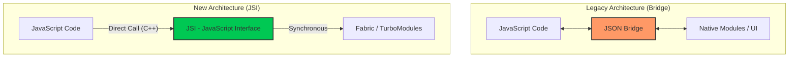
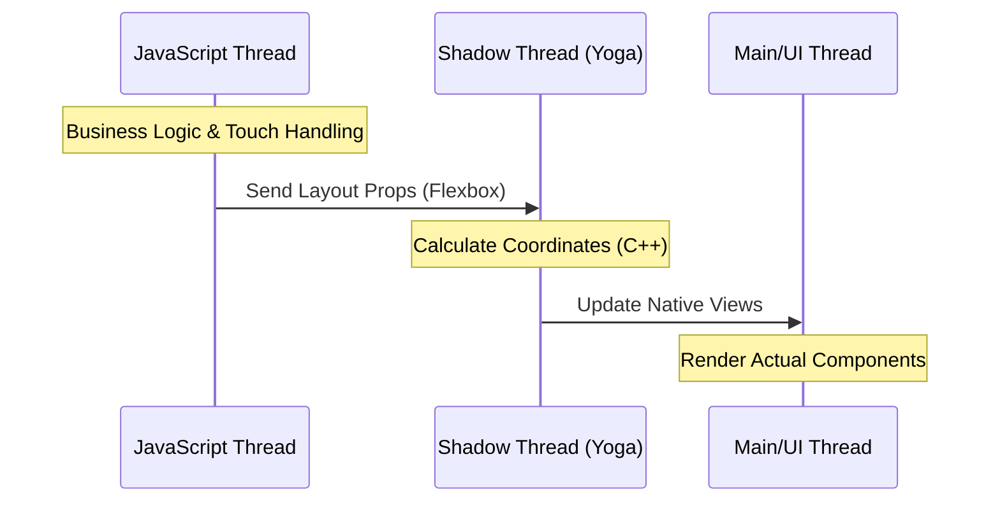
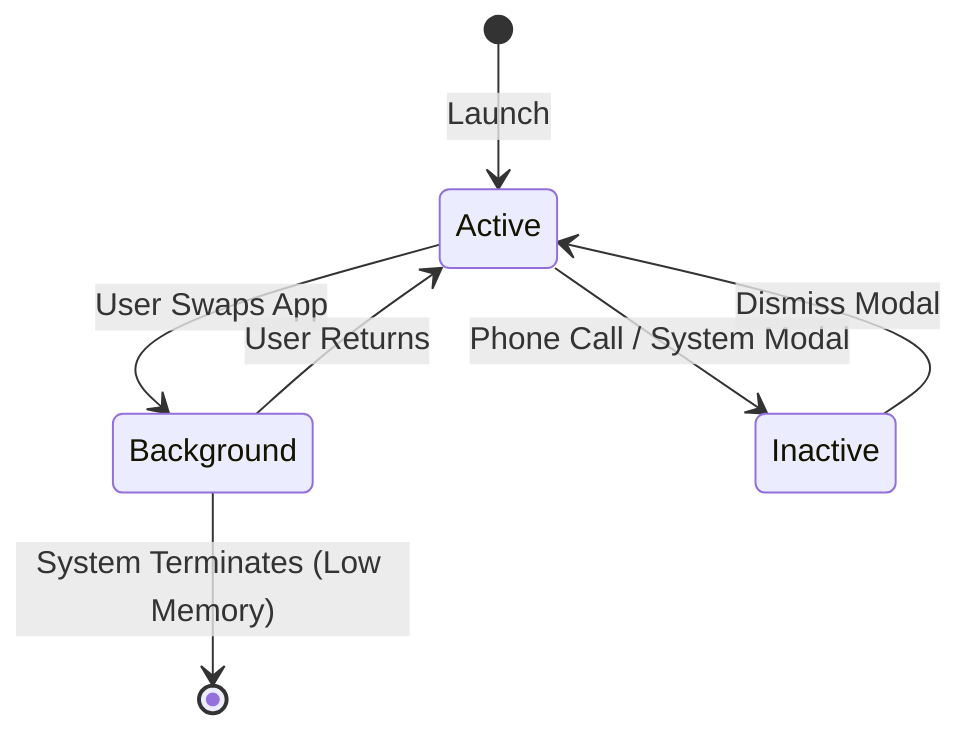

# Phase 1: Core Architecture & Fundamentals

This phase covers the foundational knowledge of React Native's bridge, the New Architecture (TurboModules/Fabric), and the core concepts that separate React Native from standard web React.

---

### 📋 Phase Overview
Before diving into advanced architecture or complex patterns, master the fundamentals that every React Native developer must know. This phase covers the essential building blocks from "What is React Native?" to basic component patterns, ensuring you can confidently discuss the framework's core concepts in any interview.

---

### Q1: WHAT IS MOBILE DEVELOPMENT?

**Question:** *"Can you explain what mobile development is and why it's important?"*

**Mobile development** is the process of creating software applications that run on mobile devices like smartphones and tablets. It's important because mobile devices have become the primary way people access the internet and use digital services worldwide.

- **Mobile-First Era:** Smartphones are the primary computing devices for most people.
- **Global Reach:** Apps can reach billions of users through app stores.
- **Innovation:** Mobile devices offer unique features like GPS, cameras, and motion sensors.

> [!TIP]
> **🟢 Absolute Beginner Tip:** Mobile apps are different from websites because they need to work offline, respond to touch gestures, and integrate with device features like camera and GPS.

### Q2: NATIVE VS HYBRID VS WEB APPS

**Question:** *"What's the difference between native, hybrid, and web apps?"*

Understanding the different types of mobile apps is fundamental to choosing the right development approach:

| Type | Technology | Performance | Development |
| :--- | :--- | :--- | :--- |
| **Native** | Swift/Java/Kotlin | Best performance | Separate iOS/Android code |
| **Hybrid** | HTML/CSS/JS + WebView | Good performance | Single codebase |
| **Web** | HTML/CSS/JS | Limited mobile features | Responsive websites |

> [!TIP]
> **🟢 Beginner Tip:** React Native creates truly native apps (like the first row), not hybrid apps (like the second row). Your React Native code becomes real native iOS/Android components.

### Q3: WHAT IS REACT NATIVE?

**Question:** *"Explain what React Native is and how it solves mobile development challenges."*

**React Native** is an open-source framework developed by Facebook (now Meta) that allows developers to build native mobile applications using JavaScript and React. It solves the challenge of maintaining separate codebases for iOS and Android by enabling **cross-platform development** with a single JavaScript codebase.

- **Single Codebase:** Write once, run on both iOS and Android.
- **Native Performance:** Uses native components for UI rendering.
- **Hot Reload:** Fast development cycle with instant updates.

#### 🏗️ Architecture Visualization (Legacy vs New)



> [!IMPORTANT]
> **⭐ Senior Insight:** While traditional React Native relies on a **JSON-based Bridge**, the framework is shifting towards the **New Architecture** using **JSI (JavaScript Interface)**. This allows direct, synchronous communication between JavaScript and Native code, eliminating the serialization overhead that often bottlenecks high-performance apps.

> [!TIP]
> **🟢 Beginner Tip:** React Native compiles to truly native apps, not web apps wrapped in native containers. Your JavaScript code runs on a JavaScript thread, but the UI is rendered using actual native components.

### Q4: JAVASCRIPT BASICS FOR RN

**Question:** *"What JavaScript concepts should you know before learning React Native?"*

React Native is built on JavaScript, so you need to understand these core concepts:

- **Variables & Data Types:** `var`, `let`, `const`, strings, numbers, booleans.
- **Functions:** Arrow functions, regular functions, callbacks.
- **Arrays & Objects:** Array methods, object destructuring.
- **ES6+ Features:** Promises, async/await, spread operator.

> [!IMPORTANT]
> **⭐ Senior Insight:** Understanding **Closures** is critical in React Native, especially when working with `useEffect` and `useCallback`. Stale closures are a common source of bugs where a function "remembers" an old version of a state or prop.

```javascript
// Variables
const name = "React Native";
let count = 0;

// Arrow function
const greet = (user) => `Hello, ${user}!`;

// Async function (important for RN)
const fetchData = async () => {
  try {
    const response = await fetch('https://api.example.com/data');
    const data = await response.json();
    return data;
  } catch (error) {
    console.error('Error:', error);
  }
};
```

> [!TIP]
> **🟢 Beginner Tip:** React Native uses modern JavaScript (ES6+), so features like arrow functions, destructuring, and async/await are essential. If you're new to JavaScript, focus on these before diving into React Native.

### Q5: REACT VS REACT NATIVE

**Question:** *"What's the difference between React and React Native?"*

While both use React's component-based architecture and JSX syntax, they target completely different platforms:

| Aspect | React | React Native |
| :--- | :--- | :--- |
| **Platform** | Web browsers | Mobile (iOS/Android) |
| **Components** | `<div>`, `<span>` | `<View>`, `<Text>` |
| **Styling** | CSS | StyleSheet API |
| **Output** | HTML/CSS/JS | Native mobile apps |

> [!IMPORTANT]
> **⭐ Senior Insight:** One of the biggest mental shifts for web developers is the lack of a "DOM". In React Native, there is no `window` or `document` object. Global variables like `navigator` are polyfilled, but you cannot use libraries that rely on DOM manipulation (like jQuery or most web-based charting libs).

> [!WARNING]
> **🪤 Follow-up Trap:** Don't say "React Native is just React for mobile" - they're different frameworks that happen to share similar syntax and patterns. React Native doesn't use HTML or CSS.

### Q6: WHAT IS A COMPONENT?

**Question:** *"Explain what components are in React Native and why they're important."*

**Components** are the building blocks of React Native applications. They are reusable, self-contained pieces of code that define how a portion of your UI should look and behave. Think of them as custom HTML tags that you create yourself.

- **Functional Component:** Simple functions that return JSX. Most common today.
- **Class Component:** Older way using ES6 classes. (Legacy)

```javascript
import React from 'react';
import { View, Text } from 'react-native';

function WelcomeMessage() {
  return (
    <View>
      <Text>Welcome to React Native!</Text>
    </View>
  );
}

// Using the component
function App() {
  return (
    <View>
      <WelcomeMessage />
      <WelcomeMessage /> {/* Reusable! */}
    </View>
  );
}
```

> [!TIP]
> **🟢 Beginner Tip:** Components should be small, focused, and reusable. A good rule is: if you copy-paste JSX more than once, make it a component.

### Q7: JSX IN REACT NATIVE

**Question:** *"What is JSX and why is it important in React Native?"*

**JSX (JavaScript XML)** is a syntax extension for JavaScript that allows you to write HTML-like code within JavaScript. It's not required but makes React Native code much more readable and maintainable.

```javascript
// Without JSX (hard to read!)
React.createElement(View, {style: styles.container},
  React.createElement(Text, {style: styles.title}, 'Hello World!'),
  React.createElement(TextInput, {
    placeholder: 'Type here...',
    onChangeText: setText
  })
);
```

// With JSX (much cleaner!)
&lt;View style={styles.container}&gt;
  &lt;Text style={styles.title}&gt;Hello World!&lt;/Text&gt;
  &lt;TextInput
    placeholder="Type here..."
    onChangeText={setText}
  /&gt;
&lt;/View&gt;

> [!TIP]
> **🟢 Beginner Tip:** JSX gets transpiled to `React.createElement()` calls by Babel. You can use any valid JavaScript expressions inside JSX by wrapping them in curly braces: `{myVariable}`, `{2 + 2}`, or even `{items.map(item => <Text>{item}</Text>)}`.

### Q8: CORE COMPONENTS

**Question:** *"What are the core components in React Native?"*

React Native provides essential components that map to native mobile UI elements:

- **📦 View:** Container (like div)
- **📝 Text:** Display text content
- **🖼️ Image:** Display images
- **📝 TextInput:** User text input

**Basic Component Usage:**
```javascript
import { View, Text, Image, TextInput } from 'react-native';

export default function App() {
  return (
    <View style={{flex: 1, padding: 20}}>
      <Text style={{fontSize: 24}}>Hello React Native!</Text>
      <Image
        source={{uri: 'https://example.com/image.jpg'}}
        style={{width: 100, height: 100}}
      />
      <TextInput
        placeholder="Type something..."
        style={{borderWidth: 1, padding: 10, marginTop: 20}}
      />
    </View>
  );
}
```

### Q9: PROPS VS STATE

**Question:** *"Explain the difference between props and state in React Native."*

**Props** and **state** are both plain JavaScript objects that hold data, but they serve different purposes:

| Feature | 📥 Props (Properties) | 🔄 State |
| :--- | :--- | :--- |
| **Origin** | Passed down from parent | Managed within the component |
| **Mutability** | Immutable (read-only) | Mutable (can be changed) |
| **Purpose** | Configuration/Static data | Interactive/Dynamic data |
| **Re-render** | Triggers on change | Triggers on update |

**Props vs State Example:**
```javascript
// Props: passed from parent
function Greeting({name}) { // 'name' is a prop
  return <Text>Hello, {name}!</Text>;
}

// State: managed internally
function Counter() {
  const [count, setCount] = useState(0); // 'count' is state

  return (
    <View>
      <Text>Count: {count}</Text>
      <TouchableOpacity onPress={() => setCount(count + 1)}>
        <Text>Increment</Text>
      </TouchableOpacity>
    </View>
  );
}
```

### Q10: USESTATE HOOK

**Question:** *"How does the useState hook work in React Native?"*

**useState** is a React Hook that allows functional components to have state. It returns an array with two elements: the current state value and a function to update it.

**useState Basic Usage:**
```javascript
import { useState } from 'react';
import { View, Text, TouchableOpacity } from 'react-native';

function Counter() {
  // Declare state variable 'count' with initial value 0
  const [count, setCount] = useState(0);

  return (
    <View style={{padding: 20}}>
      <Text style={{fontSize: 24}}>Count: {count}</Text>
      <TouchableOpacity
        style={{backgroundColor: '#007AFF', padding: 10, borderRadius: 5, marginTop: 10}}
        onPress={() => setCount(count + 1)} // Update state
      >
        <Text style={{color: 'white'}}>Increment</Text>
      </TouchableOpacity>
    </View>
  );
}
```

> [!TIP]
> **🟢 Beginner Tip:** The setter function (`setCount`) can accept a new value directly or a function that receives the previous state: `setCount(prevCount => prevCount + 1)`. Use the function form when the new state depends on the previous state.

### Q11: USEEFFECT HOOK

**Question:** *"Explain useEffect and when to use it in React Native?"*

**useEffect** allows you to perform side effects in functional components. It's equivalent to lifecycle methods like `componentDidMount`, `componentDidUpdate`, and `componentWillUnmount` combined.

**Common useEffect Patterns:**
```javascript
// 1. Run on every render (rarely needed)
useEffect(() => {
  console.log('Component rendered');
});

// 2. Run once on mount (empty dependency array)
useEffect(() => {
  fetchUserData(); // API call
}, []); // Empty array = run once

// 3. Run when specific values change
useEffect(() => {
  if (userId) {
    fetchUserProfile(userId);
  }
}, [userId]); // Run when userId changes

// 4. Cleanup function
useEffect(() => {
  const subscription = subscribeToUpdates();
  return () => subscription.unsubscribe(); // Cleanup
}, []);
```

> [!WARNING]
> **🪤 Follow-up Trap:** Forgetting the dependency array can cause infinite re-renders or stale closures. Always include dependencies or use ESLint rules to catch this.

### Q12: COMPONENT LIFECYCLE

**Question:** *"How do component lifecycle methods work in functional components?"*

Functional components use Hooks instead of lifecycle methods. The main lifecycle events are handled by `useEffect`:

| Class Component | Functional Component | When it runs |
| :--- | :--- | :--- |
| `componentDidMount` | `useEffect(() => {...}, [])` | After first render |
| `componentDidUpdate` | `useEffect(() => {...}, [deps])` | After re-renders when deps change |
| `componentWillUnmount` | `useEffect(() => { return cleanup }, [])` | Before component unmounts |

### Q13: STYLING IN REACT NATIVE

**Question:** *"How does styling work in React Native?"*

React Native uses JavaScript objects for styling, not CSS. Styles are defined using the `StyleSheet` API for performance optimization.

**StyleSheet Usage:**
```javascript
import { StyleSheet, View, Text } from 'react-native';

const styles = StyleSheet.create({
  container: {
    flex: 1,
    backgroundColor: '#fff',
    alignItems: 'center',
    justifyContent: 'center',
  },
  title: {
    fontSize: 24,
    fontWeight: 'bold',
    color: '#333',
  },
  button: {
    backgroundColor: '#007AFF',
    padding: 10,
    borderRadius: 5,
    marginTop: 20,
  },
});
```

> [!IMPORTANT]
> **⭐ Senior Insight:** Use `StyleSheet.create` because it sends the style objects to the native side **only once** and refers to them by an ID. If you use inline styles `style={{ flex: 1 }}`, a new object is created on every render, which can lead to unnecessary memory allocation and re-renders in complex UIs. Also, learn `StyleSheet.flatten()` for merging styles dynamically.

function App() {
  return (
    <View style={styles.container}>
      <Text style={styles.title}>Hello World</Text>
      <View style={styles.button}>
        <Text style={{color: 'white'}}>Press Me</Text>
      </View>
    </View>
  );
}
```

> [!TIP]
> **🟢 Beginner Tip:** React Native uses Flexbox for layout (just like CSS). The default flexDirection is 'column' (unlike 'row' in web CSS). Use `flex: 1` to make components fill available space.

### Q14: BASIC NAVIGATION

**Question:** *"How do you handle basic navigation between screens in React Native?"*

React Native doesn't include navigation by default. You typically use **React Navigation**, the most popular navigation library.

**Basic Stack Navigation:**
```javascript
// Installation: npm install @react-navigation/native @react-navigation/stack
import { NavigationContainer } from '@react-navigation/native';
import { createStackNavigator } from '@react-navigation/stack';

const Stack = createStackNavigator();

function App() {
  return (
    <NavigationContainer>
      <Stack.Navigator>
        <Stack.Screen name="Home" component={HomeScreen} />
        <Stack.Screen name="Profile" component={ProfileScreen} />
      </Stack.Navigator>
    </NavigationContainer>
  );
}

// In a component, navigate programmatically
function HomeScreen({ navigation }) {
  return (
    <View>
      <TouchableOpacity onPress={() => navigation.navigate('Profile')}>
        <Text>Go to Profile</Text>
      </TouchableOpacity>
    </View>
  );
}
```

### Q15: FLATLIST VS SCROLLVIEW

**Question:** *"What's the difference between FlatList and ScrollView?"*

**FlatList** and **ScrollView** both enable scrolling, but they're optimized for different use cases:

| Feature | 📜 ScrollView | 📋 FlatList |
| :--- | :--- | :--- |
| **Rendering** | Renders all items at once | Renders items lazily (only visible) |
| **Use Case** | Small, fixed content | Large/dynamic lists |
| **Performance** | Issues with many items | Smooth for 1000+ items |
| **Complexity** | Simple to use | More complex but performant |

**FlatList Basic Usage:**
```javascript
import { FlatList } from 'react-native';

const data = [{id: 1, title: 'Item 1'}, {id: 2, title: 'Item 2'}];

function MyList() {
  return (
    <FlatList
      data={data}
      keyExtractor={(item) => item.id.toString()}
      renderItem={({ item }) => (
        <Text style={{padding: 20, borderBottomWidth: 1}}>
          {item.title}
        </Text>
      )}
    />
  );
}
```

### Q16: PLATFORM SPECIFIC CODE

**Question:** *"How do you write platform-specific code in React Native?"*

React Native provides several ways to handle platform differences:

**Platform-Specific Code Patterns:**
```javascript
// 1. Platform module
import { Platform, Text } from 'react-native';

function MyComponent() {
  return (
    <Text>
      Running on {Platform.OS === 'ios' ? 'iOS' : 'Android'}
    </Text>
  );
}

// 2. Platform-specific file extensions
// MyComponent.ios.js (iOS only)
// MyComponent.android.js (Android only)
// MyComponent.js (fallback for both)

// 3. Platform.select()
import { Platform, StyleSheet } from 'react-native';

const styles = StyleSheet.create({
  container: {
    ...Platform.select({
      ios: {
        paddingTop: 20,
      },
      android: {
        paddingTop: 0,
      },
    }),
  },
});
```

> [!TIP]
> **🟢 Beginner Tip:** Avoid platform-specific code when possible. React Native components adapt automatically to each platform. Only use platform-specific code for truly platform-unique features.

### Q17: REACT NATIVE CLI VS EXPO

**Question:** *"What's the difference between React Native CLI and Expo?"*

**Expo** is a managed platform that simplifies React Native development, while **React Native CLI** gives you full control over the native layers.

| Feature | 🚀 Expo (Managed) | ⚙️ RN CLI (Bare) |
| :--- | :--- | :--- |
| **Setup** | Very easy (5 mins) | Complex (Xcode/AS) |
| **Native Code** | Limited access | Full access |
| **Libraries** | Expo-only + some native | Any native library |
| **Publishing** | Expo Application Services | Manual App Store/Play Store |

> [!TIP]
> **🟢 Beginner Tip:** Start with Expo if you're new - it's much easier to get started. Switch to CLI (or use Expo "prebuild") later when you need advanced native features.

### Q18: HANDLING USER INPUT

**Question:** *"How do you handle user input and form validation in React Native?"*

User input is primarily handled through the `TextInput` component with controlled state management.

**TextInput with Validation:**
```javascript
import { useState } from 'react';
import { View, TextInput, Text, Alert } from 'react-native';

function LoginForm() {
  const [email, setEmail] = useState('');
  const [password, setPassword] = useState('');
  const [errors, setErrors] = useState({});

  const validateAndSubmit = () => {
    const newErrors = {};
    if (!email.includes('@')) newErrors.email = 'Invalid email';
    if (password.length < 6) newErrors.password = 'Password too short';

    if (Object.keys(newErrors).length === 0) {
      Alert.alert('Success', 'Form submitted!');
    } else {
      setErrors(newErrors);
    }
  };

  return (
    <View style={{padding: 20}}>
      <TextInput
        placeholder="Email"
        value={email}
        onChangeText={setEmail}
        style={{ borderWidth: 1, borderColor: errors.email ? 'red' : '#ccc' }}
      />
      {errors.email && <Text style={{color: 'red'}}>{errors.email}</Text>}
      
      <TextInput
        placeholder="Password"
        value={password}
        onChangeText={setPassword}
        secureTextEntry
        style={{ borderWidth: 1, borderColor: errors.password ? 'red' : '#ccc' }}
      />
      {errors.password && <Text style={{color: 'red'}}>{errors.password}</Text>}
    </View>
  );
}
```

### Q19: ERROR HANDLING & LOADING STATES

**Question:** *"How do you handle errors and loading states in React Native?"*

Error handling in React Native follows similar patterns to React web applications, using state to manage loading and error states.

**Error and Loading States:**
```javascript
import { useState, useEffect } from 'react';
import { View, Text, ActivityIndicator, TouchableOpacity } from 'react-native';

function UserProfile({ userId }) {
  const [user, setUser] = useState(null);
  const [loading, setLoading] = useState(true);
  const [error, setError] = useState(null);

  const fetchUser = async () => {
    try {
      setLoading(true);
      const response = await fetch(`https://api.example.com/users/${userId}`);
      if (!response.ok) throw new Error('Failed to fetch user');
      const userData = await response.json();
      setUser(userData);
    } catch (err) {
      setError(err.message);
    } finally {
      setLoading(false);
    }
  };

  if (loading) return <ActivityIndicator size="large" />;
  if (error) return <Text>Error: {error}</Text>;

  return <Text>{user.name}</Text>;
}
```

### Q20: TOUCHABLE COMPONENTS

**Question:** *"How do you handle touch interactions in React Native?"*

React Native provides several touchable components. Unlike web buttons, these provide native touch feedback:

- **👆 TouchableOpacity:** Reduces opacity on press (most common).
- **🔘 TouchableHighlight:** Changes background color on press.
- **🌊 Pressable:** Modern, highly customizable touchable (preferred for new apps).
- **❌ TouchableWithoutFeedback:** No visual feedback (use sparingly).

**TouchableOpacity Example:**
```javascript
import { TouchableOpacity, Text, Alert } from 'react-native';

function MyButton() {
  return (
    <TouchableOpacity 
      onPress={() => Alert.alert('Pressed!')}
      style={{ backgroundColor: '#007AFF', padding: 10 }}
    >
      <Text style={{ color: 'white' }}>Tap Me</Text>
    </TouchableOpacity>
  );
}
```

### Q21: BASIC FLEXBOX

**Question:** *"How does Flexbox work in React Native for basic layouts?"*

React Native uses Flexbox for layout, but with some differences from web CSS. The default direction is `column` (not `row`), and you must specify dimensions.

**Basic Flexbox Layouts:**
```javascript
// Vertical layout (default)
<View style={{ flex: 1, justifyContent: 'center', alignItems: 'center' }}>
  <Text>Top</Text>
  <Text>Middle</Text>
  <Text>Bottom</Text>
</View>

// Horizontal layout
<View style={{ flexDirection: 'row', justifyContent: 'space-between' }}>
  <Text>Left</Text>
  <Text>Right</Text>
</View>

// Equal width columns
<View style={{ flexDirection: 'row' }}>
  <View style={{ flex: 1, backgroundColor: 'red' }} />
  <View style={{ flex: 1, backgroundColor: 'blue' }} />
  <View style={{ flex: 1, backgroundColor: 'green' }} />
</View>
```

> [!TIP]
> **🟢 Beginner Tip:** `flex: 1` means "take up all available space." Use it on containers to make them fill the screen. `justifyContent` controls main axis spacing, `alignItems` controls cross axis alignment.

### Q22: CONDITIONAL RENDERING

**Question:** *"How do you conditionally render components in React Native?"*

Conditional rendering works the same as in React - use JavaScript conditional operators to show/hide components based on state or props.

**Conditional Rendering Patterns:**
```javascript
function ConditionalExample({ isLoggedIn, userName }) {
  // Method 1: Ternary operator
  return (
    <View>
      {isLoggedIn ? (
        <Text>Welcome back, {userName}!</Text>
      ) : (
        <Text>Please log in</Text>
      )}
    </View>
  );
}

// Method 2: Logical AND (for simple cases)
function LoadingExample({ isLoading, data }) {
  return (
    <View>
      {isLoading && <Text>Loading...</Text>}
      {!isLoading && data && <Text>Data loaded!</Text>}
    </View>
  );
}
```

> [!TIP]
> **🟢 Beginner Tip:** Always use conditional rendering instead of hiding components with `display: 'none'` or `opacity: 0`. Hidden components still render and take up memory.

### Q23: BASIC NAVIGATION CONCEPTS

**Question:** *"What are the basic concepts of navigation in React Native?"*

Navigation in React Native is handled by libraries like React Navigation. It manages moving between different screens and maintaining navigation history.

- **Stack Navigator:** Screens stack on top of each other (like browser history).
- **Tab Navigator:** Bottom tabs for switching between main sections.
- **Drawer Navigator:** Side menu that slides in from the edge.
- **Navigation Prop:** Every screen gets a `navigation` prop for moving between screens.

**Basic Navigation Usage:**
```javascript
// In a screen component
function HomeScreen({ navigation }) {
  return (
    <View>
      <TouchableOpacity onPress={() => navigation.navigate('Profile')}>
        <Text>Go to Profile</Text>
      </TouchableOpacity>

      <TouchableOpacity onPress={() => navigation.goBack()}>
        <Text>Go Back</Text>
      </TouchableOpacity>
    </View>
  );
}
```

### Q24: BASIC API CALLS

**Question:** *"How do you make basic API calls in React Native?"*

React Native uses the same `fetch` API as modern browsers for making HTTP requests. Always handle loading states and errors.

**Basic API Call with Loading State:**
```javascript
import { useState, useEffect } from 'react';
import { View, Text, ActivityIndicator } from 'react-native';

function UserProfile({ userId }) {
  const [user, setUser] = useState(null);
  const [loading, setLoading] = useState(true);
  const [error, setError] = useState(null);

  useEffect(() => {
    fetch(`https://jsonplaceholder.typicode.com/users/${userId}`)
      .then(response => {
        if (!response.ok) throw new Error('Failed to fetch user');
        return response.json();
      })
      .then(data => {
        setUser(data);
        setLoading(false);
      })
      .catch(err => {
        setError(err.message);
        setLoading(false);
      });
  }, [userId]);

  if (loading) return <ActivityIndicator size="large" />;
  if (error) return <Text style={{color: 'red'}}>Error: {error}</Text>;

  return (
    <View>
      <Text>Name: {user.name}</Text>
      <Text>Email: {user.email}</Text>
    </View>
  );
}
```

### Q25: BASIC PERFORMANCE TIPS

**Question:** *"What are some basic performance tips for React Native beginners?"*

Good performance habits start with the basics. Here are essential tips every React Native developer should know:

- **Keys in Lists:** Always provide unique `key` props for list items to help React identify changes.
- **Avoid Inline Functions:** Don't create functions inside render if possible (use `useCallback` for expensive ones).
- **Optimize Images:** Compress images and use appropriate sizes for mobile screens.
- **Minimize Renders:** Use `React.memo` for components that don't need to re-render frequently.
- **FlatList for Lists:** Always use `FlatList` instead of `ScrollView` for long lists.

### Q26: THE THREADING MODEL

**Question:** *"Explain the threading model in React Native. What threads exist and what are their roles?"*

React Native apps run on three primary threads. Understanding these is crucial for debugging performance issues:



1.  **JavaScript Thread (JS Thread):** This is where your business logic, API calls, and touch handling live. It runs the JavaScript engine (Hermes or JSC).
2.  **Main Thread (UI Thread):** This is the native thread responsible for rendering the actual UI, handling native animations, and processing platform events (like rotations).
3.  **Shadow Thread (Layout Thread):** This thread calculates the layout of your components using the **Yoga** engine. It transforms your Flexbox styles into native coordinates that the UI thread can understand.

> [!IMPORTANT]
> **⭐ Senior Insight:** If the JS thread is busy with a heavy computation (like sorting a 10,000-item array), the app will become unresponsive to touches, even though the UI thread might still be able to run native animations (like a loading spinner). This is why we offload heavy work to native modules or use `InteractionManager`.

### Q27: APP STATES & LIFECYCLE

**Question:** *"How do you handle the application lifecycle (e.g., when the app goes to the background)?"*

Unlike web apps, mobile apps can be suspended or put into the background. React Native provides the `AppState` API to monitor these changes.



-   **active:** The app is running in the foreground.
-   **background:** The user is on another app or the home screen.
-   **inactive:** (iOS only) The app is transitioning between foreground and background (e.g., during a phone call).

```javascript
import { AppState } from 'react-native';

useEffect(() => {
  const subscription = AppState.addEventListener('change', nextAppState => {
    if (nextAppState === 'active') {
      console.log('App has come to the foreground!');
    }
    console.log('AppState:', nextAppState);
  });

  return () => subscription.remove();
}, []);
```

### Q28: METRO BUNDLER & FAST REFRESH

**Question:** *"What is Metro and what is Fast Refresh?"*

-   **Metro:** The JavaScript bundler for React Native. It takes all your JS files and combines them into a single file (the bundle) that the device can run.
-   **Fast Refresh:** A React Native feature that allows you to see changes to your code almost instantly without losing the state of your components.

> [!TIP]
> **🟢 Beginner Tip:** If your app is behaving weirdly after many changes, you can often fix it by "resetting the cache" with `npx react-native start --reset-cache`.

### Q29: FOLDER STRUCTURE FOR SCALABILITY

**Question:** *"What is a good folder structure for a large-scale React Native project?"*

While React Native doesn't enforce a structure, a common senior-level pattern is:

```text
src/
  ├── assets/      # Images, fonts, localizations
  ├── components/  # Reusable UI components (Atomic design)
  ├── navigation/  # Navigators and route definitions
  ├── screens/     # Screen components (connected to state)
  ├── services/    # API calls, storage, third-party SDKs
  ├── store/       # Redux/Zustand/State management
  ├── utils/       # Helper functions, constants, types
  └── hooks/       # Custom React hooks
```

### Q30: THE ROLE OF YOGA

**Question:** *"What is Yoga and why does React Native use it?"*

**Yoga** is a cross-platform layout engine developed by Meta. It implements a subset of Flexbox in C++. React Native uses it to calculate the layout of components on both iOS and Android, ensuring consistent UI behavior across platforms without needing to write platform-specific layout logic.

### Q31: DEBUGGING TOOLS

**Question:** *"What tools do you use for debugging React Native apps?"*

1.  **In-App Developer Menu:** (Cmd+D / Shake) Provides access to Reload, Debug JS Remotely, etc.
2.  **React DevTools:** For inspecting component hierarchy, props, and state.
3.  **Flipper (Legacy/Maintenance):** A powerful desktop app for inspecting network requests, logs, and layout.
4.  **Chrome DevTools:** Used when debugging JS remotely (legacy architecture).
5.  **Console.log:** The classic approach, visible in terminal or IDE.

### Q32: TYPESCRIPT IN REACT NATIVE

**Question:** *"Why is TypeScript recommended for React Native development?"*

TypeScript provides static typing, which catch bugs at compile-time rather than runtime. In a mobile environment, where crashes are more disruptive than web refreshes, this is critical.

-   **Type Safety for Props:** Ensures components receive the correct data.
-   **Navigation Typing:** Prevents passing incorrect parameters between screens.
-   **Better IDE Support:** Autocomplete and refactoring are much safer.

### Q33: NEW ARCHITECTURE: FABRIC & TURBOMODULES

**Question:** *"What are Fabric and TurboModules in the New Architecture?"*

-   **Fabric:** The new rendering system. It's written in C++ and allows for synchronous UI updates and better integration with host platform features.
-   **TurboModules:** The new way to write native modules. They are lazy-loaded (only loaded when needed) and allow for synchronous communication between JS and Native.

> [!IMPORTANT]
> **⭐ Senior Insight:** The key benefit of the New Architecture is the removal of the asynchronous bridge. This allows for smoother animations, faster startup times, and easier integration with native codebases.

### Q34: HERMES ENGINE

**Question:** *"What is Hermes and why is it the default engine for React Native?"*

**Hermes** is an open-source JavaScript engine optimized for running React Native on mobile. It was developed by Meta to improve app performance.

-   **Bytecode Pre-compilation:** Hermes compiles JavaScript into bytecode during the build process, which reduces app startup time.
-   **Lower Memory Usage:** It's designed to be lightweight, which is critical for low-end mobile devices.
-   **Efficient Garbage Collection:** Provides better performance for long-running apps.

> [!TIP]
> **🟢 Beginner Tip:** You can check if your app is using Hermes by looking at the `global.HermesInternal` variable.

### Q35: ASSET MANAGEMENT (IMAGES & FONTS)

**Question:** *"How do you handle images and custom fonts in React Native?"*

-   **Images:** Use the `require()` syntax for local images and `{uri: '...'}` for remote images. Local images are automatically bundled with the app.
-   **Fonts:** Custom fonts are added to the native projects (iOS/Android) and then referenced by their family name in `StyleSheet`.

```javascript
// Local image
<Image source={require('./assets/logo.png')} />

// Remote image (requires width and height)
<Image 
  source={{uri: 'https://example.com/photo.jpg'}} 
  style={{width: 200, height: 200}} 
/>
```

> [!IMPORTANT]
> **⭐ Senior Insight:** For large images, always use **FastImage** (a third-party library) for better caching and performance. For icons, prefer **Vector Icons** (SVG-based) over raster images to keep the bundle size small and ensure crispness at any scale.

---

> [!TIP]
> **Next Steps:** After mastering these fundamentals, move to **Phase 2: React Fundamentals** to dive deeper into hooks, context, and advanced state management.

---

**[Back to Top](#phase-1-core-architecture--fundamentals)** | [Phase 02: React Fundamentals ➡️](./phase2-react-fundamentals.md)
