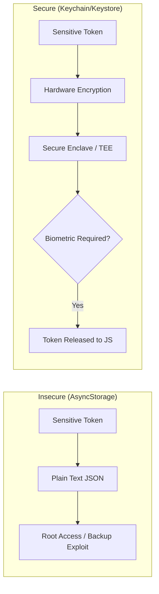

# Phase 10: Security Best Practices

> **Master the art of securing React Native applications. From biometric authentication and secure storage to SSL pinning and reverse engineering prevention, learn how to protect user data and maintain high security standards.**

---

### 📋 Phase Overview
Security is not a feature; it's a foundation. For Senior developers, protecting user data, securing network communication, and preventing reverse engineering are non-negotiable responsibilities.

---


### Q1: [SECURE STORAGE] Secure Storage Alternatives
*"Why is `AsyncStorage` considered insecure for sensitive data, and what are the alternatives?"*



`AsyncStorage` stores data in plain text on the device's disk. On rooted Android devices or through certain backup exploits on iOS, this data can be easily read by malicious actors.

| Platform | Technology | Recommended Library |
|----------|------------|----------------------|
| **iOS** | Keychain | `react-native-keychain` |
| **Android** | Keystore / EncryptedSharedPreferences | `react-native-keychain` / `react-native-mmkv` |

> [!NOTE]
> **Senior Insight: Biometric Integration**
> For high-security apps (FinTech, Health), don't just store the token in the Keychain. Use `react-native-keychain`'s biometric authentication feature to ensure the user is physically present before the token is released to your JS code. This prevents "at-rest" attacks where someone might try to programmatically extract the key while the device is unlocked.

---

### Q2: [NETWORK SECURITY] SSL Pinning
*"How does SSL Pinning prevent Man-in-the-Middle (MitM) attacks, and what are the risks?"*

SSL Pinning hardcodes the server's public key or certificate into the app. This ensures the app only talks to your server, even if a malicious actor has installed a rogue root certificate on the user's device.

**The Risks:**
- **Certificate Expiry:** If your server certificate expires and you haven't updated the app with the new pin, the app will stop working for all users.
- **Maintenance:** Requires a robust "pin rotation" strategy and often an emergency "kill switch" to disable pinning if things go wrong.

> [!TIP]
> **Follow-up Trap: "Should we pin the Leaf certificate or the Intermediate/Root certificate?"**
> **Answer:** Pinning the **Intermediate** certificate is often a better balance. Leaf certificates change frequently (every 90 days with Let's Encrypt), which would require constant app updates. Pinning the Root is too broad. The Intermediate CA is stable but specific enough to prevent generic MitM.

---

### Q3: [CODE PROTECTION] Reverse Engineering
*"How can you protect a React Native app from being reverse-engineered?"*

While no app is 100% unhackable, seniors implement "defense in depth":

1.  **Hermes Engine:** Pre-compiles JS into bytecode, making it harder to read than plain JS (though it can still be disassembled).
2.  **ProGuard/R8 (Android):** Shrinks and obfuscates Java/Kotlin code, renaming classes and methods to meaningless strings.
3.  **Jailbreak/Root Detection:** Using libraries like `react-native-jailbreak-termroot` to disable sensitive features on compromised devices.
4.  **Native Obfuscation:** Using commercial tools like DexGuard or iXGuard for maximum protection of native logic.

> [!NOTE]
> **Senior Insight: Business Logic Location**
> The ultimate security for sensitive logic is to **never put it in the client**. Critical calculations, validation, or secret generation should always happen on the backend. The mobile app should just be a "dumb terminal" for these operations.

---

### Q4: [DEEP LINKS] Deep Link Security
*"What are the security implications of using Custom URL Schemes vs. Universal Links/App Links?"*

**Custom URL Schemes** (e.g., `myapp://`) can be hijacked by any other app on the device. **Universal Links (iOS)** and **App Links (Android)** use a verified association between your website and your app (via `apple-app-site-association` and `assetlinks.json`), making them significantly more secure.

```typescript
// DeepLinkHandler.ts
const handleDeepLink = (url: string) => {
  const { path, params } = parse(url);
  // CRITICAL: Always validate sensitive actions
  if (path === '/reset-password' && !params.token) {
    logSecurityEvent('Invalid password reset attempt');
    return;
  }
};
```

---

### Q5: [OBSERVABILITY] Sensitive Data in Logs
*"How do you prevent sensitive data from leaking into logs or crash reports?"*

Logs and crash reports (Sentry/Bugsnag) are often forgotten vectors for data leaks. Seniors implement strict sanitization.

**Best Practices:**
- **Intercept Logs:** Use a custom logger that masks sensitive keys (e.g., `password`, `token`, `credit_card`) using regex.
- **Sentry `beforeSend`:** Use the `beforeSend` hook in Sentry to scrub the event object before it's sent to the server.
- **Environment Control:** Ensure `console.log` is completely stripped in production builds using `babel-plugin-transform-remove-console`.

> [!TIP]
> **Follow-up Trap: "What about Redux/Zustand state in crash reports?"**
> **Answer:** Many devs send the entire state with a crash report. This is dangerous. You should only send a sanitized version of the state or breadcrumbs that don't contain PII (Personally Identifiable Information).

---


### Q6: [SECRETS] API Key Obfuscation
*"How should you handle API keys in a React Native app?"*

There is no way to hide a secret in a client-side bundle. If a key is in your JS, it can be found.

**The Hierarchy of Security:**
1.  **The Proxy Pattern (Best):** The app never sees the API key. It talks to your own backend, which appends the key and forwards the request.
2.  **Restricted Keys:** If you must use a client-side key (e.g., Google Maps), restrict it by **Bundle ID** or **API Signature** in the provider's console.
3.  **Environment Variables:** Use `react-native-config` to keep keys out of Git, but acknowledge they will still be in the final binary.

> [!NOTE]
> **Senior Insight: The "Hardcoded Secret" Fallacy**
> Never use `dotenv` and assume it's "secure." It's a development tool for convenience, not a security tool. Any string in your `.env` file that ends up in your JS bundle is public knowledge to anyone with a decompiler.

---

### Q7: [WEBVIEWS] Content Security Policy (CSP)
*"What are the risks of using WebViews, and how do you secure them?"*

WebViews are the most vulnerable part of a React Native app because they are susceptible to XSS (Cross-Site Scripting).

**Securing WebViews:**
- **Enable CSP:** Ensure the loaded HTML has a strict Content Security Policy.
- **Disable File Access:** Set `allowFileAccess={false}` and `allowUniversalAccessFromFileURLs={false}`.
- **Origin Validation:** Use the `onShouldStartLoadWithRequest` prop to only allow navigation to trusted domains.
- **Communication Bridge:** Use `window.ReactNativeWebView.postMessage` with strict JSON schema validation on the receiving end.

---

### Q8: [AUTHENTICATION] Session Management & JWT
*"How do you securely manage JWTs and handle token expiry?"*

**The Strategy:**
- **Storage:** Store the `accessToken` in memory (state) and the `refreshToken` in the **Keychain**.
- **Silent Refresh:** Use an axios interceptor or RTK Query `baseQuery` to detect a `401 Unauthorized`, trigger a refresh call, and retry the original request.
- **Logout:** Ensure logout clears both the memory and the Keychain, and also invalidates the session on the server side.

> [!TIP]
> **Follow-up Trap: "Why not store the JWT in AsyncStorage?"**
> **Answer:** If an attacker gets access to the device (or a backup), they can grab the JWT and impersonate the user until the token expires. Keychain/Keystore provides hardware-backed encryption that makes this significantly harder.

---

### Q9: [VALIDATION] Input Validation & Sanitization
*"Why is client-side validation alone insufficient, and what are the mobile-specific sanitization needs?"*

Client-side validation is for UX; server-side validation is for security. In mobile, "input" isn't just text fields—it's deep links, push notifications, and NFC tags.

**Mobile Sanitization Strategy:**
- **Deep Link Params:** Treat every parameter as untrusted user input. Use a library like `zod` to validate the schema of the incoming URL.
- **Push Notifications:** Never trust the payload of a push notification to perform sensitive actions without re-authenticating the user.
- **XSS in HTML:** If rendering user-generated content in a WebView, use `DOMPurify` (on the server or in a separate JS context) to strip scripts.

> [!NOTE]
> **Senior Insight: The "Implicit Trust" Trap**
> Devs often trust data coming from "system" sources like the Clipboard or the Contacts API. A malicious app could populate the clipboard with a payload that exploits your app's logic when the user "pastes." Always sanitize.

---

### Q10: [NATIVE BRIDGE] Secure Native Modules
*"What are the security risks associated with the React Native Bridge, and how do you mitigate them?"*

The Bridge is the communication layer between JS and Native. If not secured, it can be an entry point for attacks.

**Mitigation Steps:**
- **Argument Validation:** In your `ReactMethod` (Java/Kotlin/Swift), strictly validate the type and range of every argument.
- **Avoid `eval()`:** Never allow the bridge to execute arbitrary strings as code.
- **Limit Surface Area:** Only expose the absolute minimum number of methods to the JS layer.
- **TurboModules:** Moving to the New Architecture (JSI) reduces the "serializable" nature of the bridge, making some types of injection harder, but still requires strict native validation.

---


### Q11: [RUNTIME PROTECTION] Debugger & Dynamic Analysis
*"How do you detect if a debugger is attached or if the app is being run in a dynamic analysis tool?"*

Seniors use "Anti-Tampering" techniques to protect intellectual property and user data.

**Detection Techniques:**
- **Is Debugger Attached:** Check the `isDebuggerConnected` flag in Android's `Debug` class or use `sysctl` in iOS to check for the `P_TRACED` flag.
- **Emulator Detection:** Check for specific hardware strings (e.g., "goldfish", "sdk_gphone") that indicate the app is running in an emulator rather than a physical device.
- **Hook Detection:** Detect the presence of hooking frameworks like **Frida** or **Xposed** by checking for specific files in the system or unexpected function redirections.

> [!TIP]
> **Follow-up Trap: "What should the app do if it detects a debugger in production?"**
> **Answer:** The app should **gracefully degrade** or **self-terminate**. However, don't just crash with a generic error; clear sensitive data from memory first and then exit.

---

### Q12: [OAUTH2] OAuth2/OIDC Mobile Best Practices
*"What is PKCE, and why is it required for OAuth2 in mobile apps?"*

**PKCE (Proof Key for Code Exchange)** prevents an attacker from intercepting the authorization code and exchanging it for a token.

**Why it's needed:**
Unlike web apps, mobile apps cannot keep a `client_secret` safe. If an attacker intercepts the custom URL scheme callback, they could steal the code. PKCE adds a dynamically generated "verifier" that only the original app knows, making the stolen code useless.

> [!NOTE]
> **Senior Insight: System Browser vs. In-App WebView**
> Always use the **System Browser** (via `ASWebAuthenticationSession` on iOS or `Custom Tabs` on Android) for login, NOT an in-app WebView. The system browser shares cookies with the main browser (allowing SSO) and prevents the app from "seeing" the user's credentials.

---

### Q13: [PRIVACY] Screenshot & Recording Prevention
*"How do you prevent users from taking screenshots or screen recordings in sensitive parts of your app?"*

This is a common requirement for banking and streaming apps (DRM).

**Implementation:**
- **Android:** Set the `FLAG_SECURE` flag on the window. This makes the screen appear black in screenshots, recordings, and the "Recent Apps" switcher.
- **iOS:** There is no direct "prevent screenshot" API. However, you can listen to the `userDidTakeScreenshotNotification` and show a warning, or use a "secure" text field hack (which hides content in recordings).

---

### Q14: [SUPPLY CHAIN] Dependency Security
*"How do you manage the security of your `node_modules` and native dependencies?"*

The biggest threat to modern apps is the **Supply Chain Attack**.

**Your Strategy:**
- **Automated Scanning:** Integrate `npm audit` or **Snyk** into your CI/CD pipeline to block builds with known vulnerabilities.
- **Lockfiles:** Always commit `yarn.lock` or `package-lock.json` to ensure every environment uses the exact same versions.
- **Native Audits:** Don't forget `Podfile.lock` and `build.gradle` dependencies. Native vulnerabilities are often more dangerous as they have higher system privileges.

> [!TIP]
> **Follow-up Trap: "What do you do when a critical dependency has a vulnerability but no update is available?"**
> **Answer:** 1. Check if you actually use the vulnerable part of the library. 2. Use `patch-package` to apply a manual fix. 3. Fork the repo. 4. If none are possible, replace the library entirely.

---

### Q15: [BIOMETRICS] Biometric Implementation Pitfalls
*"What are the common mistakes when implementing FaceID/TouchID in React Native?"*

**Common Mistakes:**
- **Trusting the Boolean:** Only checking if `isSensorAvailable` returns true and then "unlocking" the UI. An attacker can easily bypass the UI.
- **No Keychain Binding:** The biometric prompt should be a gateway to a **Keychain key**. If the biometrics fail, the key remains encrypted and the token cannot be retrieved.
- **Ignoring "New Biometry":** Not handling the case where a user adds a new fingerprint to the device. In high-security apps, you should invalidate the current session if the biometric database changes.

---


### Q16: [BASIC SECURITY] Fundamental Security Concepts
*"What are the fundamental security concepts for React Native apps?"*

Every React Native developer should understand these core security principles:

1. **Defense in Depth:** Multiple layers of security, no single point of failure.
2. **Least Privilege:** Grant minimal permissions required.
3. **Fail-Safe Defaults:** Default to secure behavior, require explicit opt-in for risky features.
4. **Zero Trust:** Never trust input, always validate and sanitize.
5. **Secure by Design:** Build security into architecture from day one.

```javascript
// ✅ SECURE: Input validation and sanitization
function SecureComponent({ userId }) {
  const [user, setUser] = useState(null);

  useEffect(() => {
    // Validate input
    if (!userId || typeof userId !== 'string' || userId.length > 50) {
      console.error('Invalid userId');
      return;
    }

    // Use parameterized queries or proper encoding
    const encodedId = encodeURIComponent(userId);
    fetch(`/api/users/${encodedId}`)
      .then(res => res.json())
      .then(setUser);
  }, [userId]);

  return <Text>{user?.name}</Text>;
}
```

> [!TIP]
> **Beginner Tip: Security Mindset**
> Security isn't an afterthought - it's a fundamental part of how you write every line of code. Always ask: "What could go wrong here?" and "How could this be exploited?"

---

### Q17: [AUTHENTICATION BASICS] Implementing Secure Authentication
*"How do you implement secure user authentication in React Native?"*

Authentication is the foundation of app security. A robust implementation involves:

1. **Secure Storage:** Store tokens in the Keychain (iOS) or Keystore (Android).
2. **Secure Communication:** Use HTTPS for all authentication requests.
3. **Token Management:** Implement silent refresh and secure logout.
4. **Biometric Integration:** Add an extra layer of security for sensitive actions.

```javascript
// Secure Authentication Flow Example
import * as Keychain from 'react-native-keychain';

async function login(credentials) {
  try {
    const response = await fetch('https://api.example.com/login', {
      method: 'POST',
      body: JSON.stringify(credentials),
    });
    const { accessToken, refreshToken } = await response.json();
    
    // Store refresh token securely
    await Keychain.setGenericPassword('session', refreshToken, {
      service: 'com.myapp.auth',
    });
    
    return accessToken;
  } catch (error) {
    console.error('Login failed', error);
  }
}
```

---

[⬅️ Phase 09: Testing](./phase9-testing-qa.md) | [Next Phase ➡️](./phase11-cicd-deployment.md)
