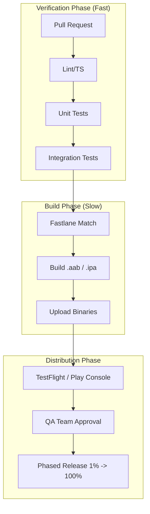

# Phase 11: CI/CD & Deployment

> **Automated Pipelines, App Store Deployment, and Release Management. Master the art of building reliable delivery systems, certificate management, Over-the-Air (OTA) updates, and phased release strategies.**

---

### 📋 Phase Overview
A Senior Engineer doesn't just "ship code"; they build **Reliable Delivery Systems**. This phase covers the automation of builds, certificate management, Over-the-Air (OTA) updates, and phased release strategies.

---

### Q1: [PIPELINE] The Gold Standard Pipeline
*"What does a 'Gold Standard' CI/CD pipeline look like for a React Native project?"*



A mature pipeline is divided into stages to provide fast feedback and ensure binary stability.

1.  **Commit Stage:** Linting (ESLint), Type checking (TSC), and Unit tests (Jest).
2.  **Verification Stage:** Component tests (RNTL) and E2E tests (Detox) on specific PRs or nightly builds.
3.  **Build Stage:** Generating `.aab` (Android) and `.ipa` (iOS) using **Fastlane**.
4.  **Distribution Stage:** Uploading to TestFlight (iOS) and Firebase App Distribution (Android) for QA.

> [!NOTE]
> **Senior Insight: Fastlane Match**
> Never manage certificates manually. Use **Fastlane Match** to store encrypted certificates in a private Git repo. This ensures the entire team (and the CI server) uses the same signing identity, avoiding the "it doesn't build on my machine" nightmare during release week.

---

### Q2: [OTA UPDATES] Over-the-Air (OTA) Updates
*"When should you use OTA updates (CodePush/Expo Updates), and what are the critical limitations?"*

OTA updates allow you to fix JS bugs or update assets without waiting for App Store review.

**The Golden Rule:** OTA updates can ONLY change the JavaScript bundle and assets. If you add a new native library or change `Info.plist/AndroidManifest.xml`, an OTA update will **crash the app** for users on the old native version.

> [!WARNING]
> **Follow-up Trap: "How do you prevent an OTA update from crashing an older version of the app?"**
> **Answer:** Use **Target Binary Versioning**. Ensure the OTA update is only delivered to the specific native build version it was tested against. In CodePush, this is handled via the `--targetBinaryVersion` flag.

---

### Q3: [RELEASES] Phased Release Strategy
*"What is a 'Phased Release' and why is it essential for mobile?"*

Unlike web, you cannot "roll back" a native app once it's downloaded. A **Phased Release** (available in both App Store and Play Store) allows you to release to a small percentage of users (e.g., 1%, 5%, 20%) over 7 days.

**Senior Approach:** Monitor Sentry and Crashlytics during the 1% phase. If the crash rate spikes, **Pause** the release immediately, fix the bug, and submit a new version. This limits the "blast radius" of a bad release.

---

### Q4: [ENVIRONMENTS] Environment Management
*"How do you manage multiple environments (Staging, Production) in React Native?"*

Seniors avoid hardcoded URLs. They use tools like `react-native-config` combined with **Build Flavors (Android)** and **Schemes (iOS)@.

```ruby
# Fastfile
lane :beta do
  match(type: "appstore")
  gym(scheme: "MyApp-Staging")
  pilot(skip_waiting_for_build_processing: true)
end
```

> [!NOTE]
> **Senior Insight: Native Configurations**
> Don't just use JS-level environment variables. For things like API keys for native SDKs (Firebase, Maps), you must configure them in the native files (`AndroidManifest.xml`, `Info.plist`) using build-time variables provided by the build system.

---

### Q5: [REVIEW] App Store Review Rejections
*"What are the most common reasons for App Store rejections in React Native, and how do you avoid them?"*

**Common Reasons:**
- **Incomplete Information:** Not providing a demo account for reviewers.
- **Performance:** App crashes on launch (often due to missing native dependencies in the release build).
- **Privacy:** Requesting permissions (Camera, Location) without a clear usage description in `Info.plist`.
- **UI/UX:** Using "Web-like" interactions that don't follow the Human Interface Guidelines (HIG).

> [!WARNING]
> **Follow-up Trap: "Apple rejected my app because it uses CodePush. Is CodePush illegal?"**
> **Answer:** No. Apple's guidelines (Section 2.4.5) allow downloading code that is run by the system's built-in interpreter (JSCore/Hermes), provided it doesn't significantly change the app's primary purpose.

---

### Q6: [SCREENSHOTS] Automating Screenshots
*"How do you handle generating screenshots for 20+ languages and multiple device sizes?"*

Manual screenshots are a waste of senior engineering time. Use **Fastlane Frameit** and **Snapshot**.

**The Workflow:**
1.  Write UI tests (using `XCUITest` or `UiAutomator`) that navigate to key screens.
2.  Take screenshots at specific points in the test.
3.  Use `frameit` to put those screenshots into device frames and add translated marketing text.
4.  Upload them automatically to App Store Connect and Google Play Console.

---

### Q7: [VERSIONING] Mobile Semantic Versioning
*"How does versioning in mobile differ from standard SemVer?"*

Mobile has two version numbers:
- **Version Name (Marketing Version):** e.g., `1.2.0`. Shown to users.
- **Build Number (Version Code):** e.g., `42`. An integer that must always increase.

> [!TIP]
> **Senior Tip:** Use a script to automatically increment the build number based on the number of commits or the CI build ID. This prevents "Duplicate Version" errors during upload.

---

### Q8: [MONITORING] Sentry vs. Crashlytics
*"Which monitoring tool would you choose for a large-scale React Native app, and why?"*

**Sentry** is usually preferred for React Native because it has superior support for **Source Maps**. It can map a crash in the obfuscated JS bundle back to the exact line in your TypeScript source.

**Crashlytics** is excellent for native-level crashes and is free, but its JS-layer reporting is less detailed than Sentry's.

> [!NOTE]
> **Senior Insight: Breadcrumbs**
> Don't just look at the stack trace. Use **Breadcrumbs** (logs of user actions leading up to the crash) to reproduce "impossible" bugs. In Sentry, you can automatically capture navigation events, button clicks, and API calls.

---

### Q9: [FLAGS] Feature Flags & Remote Config
*"How do you implement feature flags to decouple 'Deployment' from 'Release'?"*

A feature is **Deployed** when the code is in the binary, but **Released** when the flag is turned on.

**Implementation:**
- Use **Firebase Remote Config** or **LaunchDarkly**.
- Fetch the flags at app startup and store them in a local cache.
- Use a hook like `useFeatureFlag('new_checkout_flow')` to conditionally render UI.

> [!WARNING]
> **Follow-up Trap: "What happens if the app is offline and can't fetch the flags?"**
> **Answer:** Always provide **Default Values** in your code. The app should function perfectly with a "safe" set of default flags if the network is unavailable.

---

### Q10: [DEPENDENCIES] Modern Dependency Management
*"Why might you choose Yarn Berry (v3+) or pnpm over standard npm for a React Native monorepo?"*

- **pnpm:** Uses a content-addressable store to save disk space and is significantly faster at installing dependencies.
- **Yarn Berry:** Provides **Zero Installs** (storing dependencies in Git) and excellent support for workspace protocols in monorepos.

**Crucial Note:** standard React Native has historically struggled with "Plug'n'Play" (PnP). Most teams use the `node-modules` linker even when using modern Yarn or pnpm.

---

### Q11: [CI/CD] GitHub Actions for React Native
*"How do you set up a basic GitHub Actions workflow for a React Native project?"*

A robust CI/CD pipeline ensures code quality and automates the release process.

**Basic Workflow (.github/workflows/main.yml):**
```yaml
name: CI
on: [push, pull_request]

jobs:
  test:
    runs-on: ubuntu-latest
    steps:
      - uses: actions/checkout@v4
      - name: Install dependencies
        run: npm ci
      - name: Run Lint
        run: npm run lint
      - name: Run Tests
        run: npm test
```

---

### Q12: [FASTLANE] Automating Deployments
*"What is Fastlane and why is it essential for React Native development?"*

**Fastlane** is an open-source platform that simplifies Android and iOS deployment. It handles tedious tasks like:

- **Match:** Syncing certificates and profiles across the team.
- **Screengrab/Snapshot:** Automating localized screenshots.
- **Supply/Deliver:** Uploading binaries and metadata to stores.
- **Gym:** Building the app (IPA/AAB).

---

### Q13: [OTA] CodePush vs. Standard Updates
*"Explain Over-The-Air (OTA) updates. When should you NOT use CodePush?"*

OTA updates allow you to push JS bundle and asset changes directly to users without a store review.

**When NOT to use CodePush:**
- **Native Changes:** If you add a new native library (e.g., `react-native-reanimated`) or change `AndroidManifest.xml`/`Info.plist`.
- **Large UI Overhauls:** Major changes might violate store policies regarding "changing the app's purpose."
- **Breaking API Changes:** If the JS depends on a new backend version that isn't backwards compatible with older app versions.

---

### Q14: [SECURITY] Managing Secrets in CI/CD
*"How do you securely handle API keys and signing certificates in a CI environment?"*

Never hardcode secrets. Use environment-specific strategies:

1.  **CI Secrets:** Store keys (e.g., `MAPS_API_KEY`) in GitHub Secrets or Bitrise Env Vars.
2.  **Base64 Encoding:** For files like `.keystore` or `GoogleService-Info.plist`, encode them to Base64, store as a secret, and decode during the build.
3.  **Fastlane Match:** Use a private git repository to store encrypted iOS certificates and provisioning profiles.

---

### Q15: [ENVIRONMENT] Multi-Environment Builds
*"How do you handle different environments (Dev, Staging, Prod) in React Native?"*

Standardize using **Build Variants** (Android) and **Schemes** (iOS).

- **Android:** Define `productFlavors` in `build.gradle` (e.g., `dev`, `prod`).
- **iOS:** Create different Configurations (Debug, Release, Staging) and Schemes.
- **Library:** Use `react-native-config` or `expo-constants` to access variables at runtime.

---

### Q16: [MONITORING] Error Reporting in Production
*"How do you track errors and performance after the app is live?"*

A senior engineer relies on:
- **Crashlytics/Sentry:** For tracking fatal crashes and JS-side breadcrumbs.
- **Firebase Analytics:** To monitor user flow and conversion.
- **Performance Monitoring:** Tracking "Time to Interactive" (TTI) and frame drops (FPS) in the wild.

---

### Q17: [FASTLANE SETUP] Automating app store deployments with Fastlane
*"How do you automate the deployment process to the App Store and Google Play?"*

**Fastlane** automates the tedious parts of mobile deployment:

**Fastlane Configuration:**
```ruby
# Gemfile
source "https://rubygems.org"
gem "fastlane"

# fastlane/Fastfile
default_platform(:ios)

platform :ios do
  desc "Push a new beta build to TestFlight"
  lane :beta do
    increment_build_number(xcodeproj: "MyApp.xcodeproj")
    build_app(
      scheme: "MyApp",
      export_method: "app-store",
      export_options: {
        provisioningProfiles: {
          "com.myapp.bundle" => "MyApp AppStore"
        }
      }
    )
    upload_to_testflight
  end

  desc "Deploy a new version to the App Store"
  lane :release do
    # Ensure we're on the right branch
    ensure_git_branch(branch: 'main')

    # Ensure we have a clean git status
    ensure_git_status_clean

    # Get the latest version from package.json
    package = load_json(json_path: "./package.json")
    version = package["version"]

    # Set iOS version
    increment_version_number(
      version_number: version,
      xcodeproj: "MyApp.xcodeproj"
    )

    # Build and upload
    build_app(
      scheme: "MyApp",
      export_method: "app-store"
    )

    upload_to_app_store(
      force: true,
      reject_if_possible: true,
      skip_metadata: false,
      skip_screenshots: false,
      skip_binary_upload: false
    )

    # Create git tag
    add_git_tag(tag: "ios/v#{version}")
    push_git_tags
  end
end

platform :android do
  desc "Deploy a new version to the Google Play Store"
  lane :release do
    # Ensure we're on the right branch
    ensure_git_branch(branch: 'main')

    package = load_json(json_path: "./package.json")
    version = package["version"]

    # Set Android version
    increment_version_code(
      gradle_file_path: "android/app/build.gradle"
    )

    increment_version_name(
      gradle_file_path: "android/app/build.gradle",
      version_name: version
    )

    # Build AAB (Android App Bundle)
    gradle(
      task: "bundle",
      build_type: "Release",
      project_dir: "android"
    )

    # Upload to Google Play
    upload_to_play_store(
      track: 'production',
      aab: 'android/app/build/outputs/bundle/release/app-release.aab'
    )

    # Create git tag
    add_git_tag(tag: "android/v#{version}")
    push_git_tags
  end
end
```

---

### Q18: [CODEPUSH OTA] Implementing over-the-air updates with CodePush
*"How do you implement over-the-air (OTA) updates for a React Native app?"*

**CodePush** enables instant app updates without app store releases:

**CodePush Integration:**
```javascript
// Installation
// npm install react-native-code-push
// npx react-native link react-native-code-push (or autolinking)

// App.js
import codePush from "react-native-code-push";

const codePushOptions = {
  checkFrequency: codePush.CheckFrequency.ON_APP_RESUME,
  installMode: codePush.InstallMode.IMMEDIATE,
  mandatoryInstallMode: codePush.InstallMode.IMMEDIATE,
};

function App() {
  const [syncStatus, setSyncStatus] = useState(null);

  useEffect(() => {
    // Listen to sync status updates
    const syncListener = (status) => {
      setSyncStatus(status);
      console.log('CodePush sync status:', status);
    };

    codePush.getUpdateMetadata().then((update) => {
      if (update) {
        console.log('Current update:', update.label);
      }
    });

    return () => {
      // Cleanup if needed
    };
  }, []);

  const handleManualSync = () => {
    codePush.sync(
      {
        installMode: codePush.InstallMode.ON_NEXT_RESUME,
        mandatoryInstallMode: codePush.InstallMode.IMMEDIATE,
      },
      (status) => {
        console.log('Manual sync status:', status);
      },
      (progress) => {
        console.log('Download progress:', progress);
      }
    );
  };

  return (
    <View style={styles.container}>
      <Text>App Version: {DeviceInfo.getVersion()}</Text>
      <Text>CodePush Status: {syncStatus}</Text>

      <TouchableOpacity onPress={handleManualSync}>
        <Text>Check for Updates</Text>
      </TouchableOpacity>
    </View>
  );
}

export default codePush(codePushOptions)(App);

// Deployment script
// npx appcenter codepush release-react -a MyApp/Android -d Production
// npx appcenter codepush release-react -a MyApp/iOS -d Production
```

> [!TIP]
> **Beginner Tip:** CodePush is perfect for bug fixes and small feature updates. Never use it for breaking changes that require native code updates - those still need app store releases.

---

### Q19: [ENVIRONMENT MANAGEMENT] Managing different environments (dev, staging, production)
*"How do you handle different API URLs and keys for development, staging, and production?"*

Proper environment management prevents configuration mistakes:

**Environment Configuration:**
```javascript
// config/index.js
const environments = {
  development: {
    API_URL: 'http://localhost:3000/api',
    SENTRY_DSN: null,
    CODEPUSH_KEY: null,
    ANALYTICS_KEY: null,
  },
  staging: {
    API_URL: 'https://api-staging.myapp.com',
    SENTRY_DSN: 'https://staging-sentry-dsn@sentry.io/project',
    CODEPUSH_KEY: 'staging-codepush-key',
    ANALYTICS_KEY: 'staging-analytics-key',
  },
  production: {
    API_URL: 'https://api.myapp.com',
    SENTRY_DSN: 'https://prod-sentry-dsn@sentry.io/project',
    CODEPUSH_KEY: 'prod-codepush-key',
    ANALYTICS_KEY: 'prod-analytics-key',
  },
};

// Determine current environment
const getCurrentEnvironment = () => {
  // Check for __DEV__ (React Native development mode)
  if (__DEV__) return 'development';

  // Check app version for staging (common pattern)
  const version = DeviceInfo.getVersion();
  if (version.includes('-staging') || version.includes('-beta')) {
    return 'staging';
  }

  return 'production';
};

export const config = {
  ...environments[getCurrentEnvironment()],
  environment: getCurrentEnvironment(),
};

// Usage in app
import { config } from './config';

console.log('Current environment:', config.environment);
console.log('API URL:', config.API_URL);

// Environment-specific components
function DebugMenu() {
  if (config.environment !== 'development') {
    return null;
  }

  return (
    <View style={styles.debugMenu}>
      <Text>Debug Tools</Text>
      <TouchableOpacity onPress={() => console.log('Debug action')}>
        <Text>Debug Action</Text>
      </TouchableOpacity>
    </View>
  );
}
```

---

### Q20: [APP STORE SUBMISSION] Preparing and submitting apps to app stores
*"What is the checklist for submitting a React Native app to the Apple App Store and Google Play Store?"*

App store submission is a complex process with many requirements:

**App Store Preparation:**
```javascript
// app.json / app.config.js (Expo)
{
  "expo": {
    "name": "My Awesome App",
    "slug": "my-awesome-app",
    "version": "1.0.0",
    "orientation": "portrait",
    "icon": "./assets/icon.png",
    "userInterfaceStyle": "light",
    "splash": {
      "image": "./assets/splash.png",
      "resizeMode": "contain",
      "backgroundColor": "#ffffff"
    },
    "assetBundlePatterns": [
      "**/*"
    ],
    "ios": {
      "supportsTablet": true,
      "bundleIdentifier": "com.mycompany.myapp",
      "buildNumber": "1.0.0",
      "icon": "./assets/icon-ios.png",
      "splash": {
        "image": "./assets/splash-ios.png"
      }
    },
    "android": {
      "adaptiveIcon": {
        "foregroundImage": "./assets/adaptive-icon.png",
        "backgroundColor": "#ffffff"
      },
      "package": "com.mycompany.myapp",
      "versionCode": 1,
      "icon": "./assets/icon-android.png",
      "splash": {
        "image": "./assets/splash-android.png"
      },
      "permissions": [
        "android.permission.INTERNET",
        "android.permission.SYSTEM_ALERT_WINDOW"
      ]
    },
    "plugins": [
      [
        "expo-build-properties",
        {
          "android": {
            "compileSdkVersion": 34,
            "targetSdkVersion": 34,
            "buildToolsVersion": "34.0.0"
          },
          "ios": {
            "deploymentTarget": "13.4"
          }
        }
      ]
    ]
  }
}
```

**iOS App Store Connect requirements:**
1. App Icons (various sizes)
2. Screenshots (5-10 per device type)
3. App Description and Keywords
4. Privacy Policy URL
5. Support URL
6. App Category and Subcategory
7. Content Rights
8. Age Rating

**Android Play Store requirements:**
1. App Icons (various densities)
2. Feature Graphic (1024x500)
3. Screenshots (2-8 per device type)
4. Short and Full Description
5. App Category
6. Content Rating
7. Privacy Policy
8. Target Audience

**Automated screenshot generation:**
```ruby
# fastlane/Fastfile
desc "Generate and upload screenshots"
lane :screenshots do
  # For iOS
  capture_ios_screenshots

  # For Android
  capture_android_screenshots

  # Upload to stores
  upload_to_app_store(
    skip_binary_upload: true,
    skip_metadata: false,
    skip_screenshots: false
  )
end
```

### Q21: [DEPLOYMENT STRATEGIES] Choosing between app stores vs direct distribution
*"When would you use enterprise distribution or direct APK/IPA over the standard App Store/Play Store?"*

Different deployment strategies for different use cases:

| Method | Pros | Cons | Best For |
| :--- | :--- | :--- | :--- |
| **App Store/Play Store** | Discovery, trust, payments | 30% fee, review delays | Consumer apps |
| **Enterprise Distribution** | No fees, instant updates | Limited discovery, complex setup | Internal tools |
| **Direct APK/IPA** | No fees, full control | Security risks, complex distribution | Beta testing, custom distribution |

---

### Q22: [ROLLBACK STRATEGIES] Planning for deployment failures and rollbacks
*"What is your strategy for rolling back a failed production deployment?"*

Always have a rollback plan for when deployments go wrong:

**Rollback workflow:**
```yaml
# Rollback workflow
name: Rollback Deployment

on:
  workflow_dispatch:
    inputs:
      version:
        description: 'Version to rollback to'
        required: true
      reason:
        description: 'Reason for rollback'
        required: true

jobs:
  rollback:
    runs-on: ubuntu-latest

    steps:
    - name: Rollback iOS
      run: |
        # Rollback TestFlight
        # Rollback CodePush

    - name: Rollback Android
      run: |
        # Rollback Play Store to previous version
        # Rollback CodePush
```

---

### Q23: [MONITORING & ALERTS] Setting up deployment monitoring and alerting
*"How do you monitor the health of a new deployment and get alerted for issues?"*

Monitor deployments and get alerts when things go wrong:

**Deployment Monitoring:**
```yaml
# Deployment monitoring with DataDog
monitors:
  - name: "Deployment Success Rate"
    type: "metric alert"
    query: "avg(last_1h):avg:deployment.success_rate{environment:production} < 95"
    message: "Deployment success rate dropped below 95%"
```

---

### Q24: [FEATURE FLAGS] Implementing feature flags for safe deployments
*"How do you use feature flags to perform safe, incremental rollouts?"*

Feature flags allow you to deploy code without exposing features to users:

**Feature Flag Implementation:**
```javascript
// Feature flag service
class FeatureFlags {
  constructor() {
    this.flags = {};
    this.loadFlags();
  }

  async loadFlags() {
    try {
      const response = await fetch('/api/feature-flags');
      this.flags = await response.json();
    } catch (error) {
      this.flags = this.defaultFlags;
    }
  }

  isEnabled(flagName) {
    return this.flags[flagName] || false;
  }
}

function NewFeature({ userId }) {
  const isEnabled = FeatureFlags.isEnabled('new-dashboard');

  if (!isEnabled) {
    return <OldDashboard />;
  }

  return <NewDashboard />;
}
```

---

### Q25: [PERFORMANCE BUDGETS] Setting and enforcing performance budgets
*"What are performance budgets and how do you enforce them in CI?"*

Performance budgets prevent deployments that degrade user experience:

**Performance Budgets:**
```yaml
# budget.json (Lighthouse)
{
  "budgets": [
    {
      "timings": [
        {
          "metric": "interactive",
          "budget": 3000
        }
      ]
    }
  ]
}
```

---

[⬅️ Phase 10: Security](phase10-security-best-practices.md) | [Phase 12: Defense ➡️](phase12-portfolio-defense.md)
