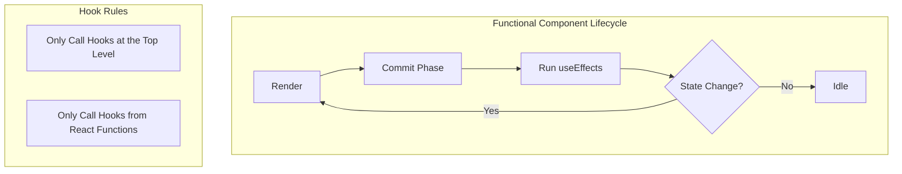

# Phase 02: React Fundamentals Deep Dive

Mastering Hooks, Lifecycle, State Management, and Performance Optimization

---

### 📋 Phase Overview
Building on Phase 1's basics, this phase dives deep into React's core concepts with a focus on mobile-specific optimizations. You'll learn everything from basic hooks to advanced patterns that make React Native apps performant and maintainable.

---

### Q1: What is React and why use it in React Native?
**React** is a JavaScript library for building user interfaces, created by Facebook. React Native uses React as its foundation because React provides excellent patterns for:

- **Component-Based Architecture**: Reusable UI building blocks.
- **Declarative Programming**: Describe what UI should look like.
- **Virtual DOM**: Efficient rendering optimization.

> [!TIP]
> **Beginner Tip:** React's "Learn once, write anywhere" philosophy is perfect for React Native - you learn React concepts once and can build both web and mobile apps.


### Q2: Explain functional vs class components in React.
React components can be written as functions or classes, but functional components with hooks are now the standard:

| Functional Components (Modern) | Class Components (Legacy) |
| :--- | :--- |
| Use hooks for state and lifecycle | Use `this.state` and lifecycle methods |
| Less code, easier to test | More verbose code |
| Better performance (no class overhead) | Still supported but not recommended |
| React's recommended approach | Being phased out in new code |

```javascript
// Functional Component (Preferred)
function Counter() {
  const [count, setCount] = useState(0);

  return (
    <TouchableOpacity onPress={() => setCount(count + 1)}>
      <Text>Count: {count}</Text>
    </TouchableOpacity>
  );
}

// Class Component (Legacy)
class Counter extends Component {
  constructor(props) {
    super(props);
    this.state = { count: 0 };
  }

  render() {
    return (
      <TouchableOpacity onPress={() => this.setState({count: this.state.count + 1})}>
        <Text>Count: {this.state.count}</Text>
      </TouchableOpacity>
    );
  }
}
```

### Q3: What are React Hooks and why were they introduced?
**Hooks** are functions that let you "hook into" React state and lifecycle features from functional components. They were introduced to solve problems with class components:



-   **Reusing logic** between components without render props or HOCs.
- **Complex components** split across lifecycle methods.
- **Related code** grouped together instead of scattered.
- **No more confusing** `this` binding issues.

```javascript
import { useState, useEffect } from 'react';

function UserProfile({ userId }) {
  const [user, setUser] = useState(null);        // State hook
  const [loading, setLoading] = useState(true);  // Another state hook

  useEffect(() => {                              // Effect hook
    fetchUser(userId).then(setUser);
    setLoading(false);
  }, [userId]);

  if (loading) return <Text>Loading...</Text>;
  return <Text>Hello {user.name}!</Text>;
}
```

### Q4: Explain useState hook with examples.
**useState** is the most basic and commonly used React hook. It allows functional components to have state:

```javascript
// Simple counter
function Counter() {
  const [count, setCount] = useState(0);

  return (
    <View>
      <Text>Count: {count}</Text>
      <TouchableOpacity onPress={() => setCount(count + 1)}>
        <Text>Increment</Text>
      </TouchableOpacity>
    </View>
  );
}

// Object state
function UserForm() {
  const [user, setUser] = useState({
    name: '',
    email: '',
    age: 0
  });

  const updateField = (field, value) => {
    setUser(prev => ({
      ...prev,
      [field]: value
    }));
  };

  return (
    <View>
      <TextInput
        placeholder="Name"
        value={user.name}
        onChangeText={(value) => updateField('name', value)}
      />
    </View>
  );
}

// Lazy initialization (for expensive computations)
function ExpensiveComponent() {
  const [data, setData] = useState(() => {
    console.log('Computing initial value...');
    return expensiveCalculation();
  });

  return <Text>Data: {data}</Text>;
}
```

> [!TIP]
> **Beginner Tip:** When updating objects or arrays in state, always use the functional update form (`setState(prev => ...)`) or spread syntax to avoid stale closure bugs.

### Q5: Master useEffect hook - timing, dependencies, and cleanup.
**useEffect** handles side effects in functional components. It's like `componentDidMount`, `componentDidUpdate`, and `componentWillUnmount` combined:

```javascript
// 1. Run on every render (rarely needed)
useEffect(() => {
  console.log('Component rendered');
});

// 2. Run once on mount (API calls, subscriptions)
useEffect(() => {
  const fetchData = async () => {
    const data = await api.get('/user');
    setUser(data);
  };
  fetchData();
}, []); // Empty dependency array = run once

// 3. Run when specific values change
useEffect(() => {
  if (userId) {
    fetchUser(userId);
  }
}, [userId]); // Run when userId changes

// 4. Cleanup function (remove listeners, cancel requests)
useEffect(() => {
  const subscription = subscribeToUpdates();
  return () => {
    subscription.unsubscribe(); // Cleanup on unmount
  };
}, []);

// 5. Async effects (common pattern)
useEffect(() => {
  let isMounted = true;

  const loadData = async () => {
    try {
      const result = await fetchData();
      if (isMounted) setData(result);
    } catch (error) {
      if (isMounted) setError(error);
    }
  };

  loadData();

  return () => {
    isMounted = false; // Prevent state updates after unmount
  };
}, []);
```

> [!WARNING]
> **Follow-up Trap:** *"What happens if I forget the dependency array?"*
> **Answer:** The effect runs after every render, which can cause infinite loops, poor performance, or stale closures. Always include all dependencies or use ESLint to catch this.


### Q6: useReducer for complex state logic.
**useReducer** is an alternative to `useState` for complex state logic. It follows the Redux pattern with actions and reducers:

```javascript
// Counter with useReducer
const initialState = { count: 0 };

function reducer(state, action) {
  switch (action.type) {
    case 'increment':
      return { count: state.count + 1 };
    case 'decrement':
      return { count: state.count - 1 };
    case 'reset':
      return initialState;
    default:
      return state;
  }
}

function Counter() {
  const [state, dispatch] = useReducer(reducer, initialState);

  return (
    <View>
      <Text>Count: {state.count}</Text>
      <TouchableOpacity onPress={() => dispatch({ type: 'increment' })}>
        <Text>+</Text>
      </TouchableOpacity>
    </View>
  );
}

// Complex form state
const formReducer = (state, action) => {
  switch (action.type) {
    case 'UPDATE_FIELD':
      return { ...state, [action.field]: action.value };
    case 'RESET_FORM':
      return action.initialState;
    case 'VALIDATE':
      return { ...state, errors: validateForm(state) };
    default:
      return state;
  }
};

function useFormReducer(initialState) {
  return useReducer(formReducer, initialState);
}
```

> [!TIP]
> **Beginner Tip:** Use `useReducer` when you have complex state logic with multiple sub-values or when the next state depends on the previous state in complex ways. For simple state, `useState` is usually easier.

### Q7: useMemo and useCallback for performance.
**useMemo** memoizes expensive calculations, **useCallback** memoizes function definitions. Both prevent unnecessary re-renders:

```javascript
// useMemo: Expensive calculation
const total = useMemo(() =>
  items.reduce((sum, item) => sum + item.price, 0),
[items]);

// useCallback: Function reference
const handleSubmit = useCallback((data) => {
  submitForm(data);
}, []);
```

> [!TIP]
> **Beginner Tip:** Don't use `useMemo` everywhere - only for expensive calculations. Simple operations like string concatenation don't need memoization.

### Q8: Context API vs Redux/Zustand.
**Context API** is built-in but causes all consumers to re-render when values change. Use it for static or low-frequency data like themes and user auth:

```javascript
// Create context
const ThemeContext = React.createContext('light');

// Provider component
function App() {
  const [theme, setTheme] = useState('light');

  return (
    <ThemeContext.Provider value={{ theme, setTheme }}>
      <HomeScreen />
    </ThemeContext.Provider>
  );
}

// Consumer with useContext hook (preferred)
function ThemeButton() {
  const { theme, setTheme } = useContext(ThemeContext);

  return (
    <TouchableOpacity
      onPress={() => setTheme(theme === 'light' ? 'dark' : 'light')}
    >
      <Text>Switch to {theme === 'light' ? 'dark' : 'light'} theme</Text>
    </TouchableOpacity>
  );
}
```

### Q9: Component re-rendering rules and optimization.
Components re-render when their state, props, or consumed context changes. Understanding this is crucial for performance:

```javascript
// React.memo for component memoization
const ListItem = React.memo(({ item, onPress }) => (
  <TouchableOpacity onPress={() => onPress(item.id)}>
    <Text>{item.name}</Text>
  </TouchableOpacity>
));

// useCallback for stable function references
const handlePress = useCallback((id) => {
  doSomething(id);
}, []); // Empty deps = stable function reference
```

### Q10: Error boundaries in React Native.
**Error boundaries** catch JavaScript errors in the component tree, preventing the entire app from crashing. They only catch errors in the React component tree:

```javascript
// Class-based error boundary
class ErrorBoundary extends Component {
  constructor(props) {
    super(props);
    this.state = { hasError: false, error: null };
  }

  static getDerivedStateFromError(error) {
    return { hasError: true, error };
  }

  componentDidCatch(error, errorInfo) {
    console.error('Error caught by boundary:', error, errorInfo);
  }

  render() {
    if (this.state.hasError) {
      return (
        <View style={{ flex: 1, justifyContent: 'center', alignItems: 'center' }}>
          <Text style={{ fontSize: 18, color: 'red' }}>
            Something went wrong!
          </Text>
        </View>
      );
    }

    return this.props.children;
  }
}

// Usage
function App() {
  return (
    <ErrorBoundary>
      <MainScreen />
    </ErrorBoundary>
  );
}
```


### Q11: Custom hooks design patterns.
**Custom hooks** extract component logic into reusable functions. They follow the naming convention of starting with "use":

```javascript
// API hook
function useApi(endpoint) {
  const [data, setData] = useState(null);
  const [loading, setLoading] = useState(true);
  const [error, setError] = useState(null);

  useEffect(() => {
    fetch(endpoint)
      .then(res => res.json())
      .then(setData)
      .catch(setError)
      .finally(() => setLoading(false));
  }, [endpoint]);

  return { data, loading, error };
}

// Usage
function UserProfile({ userId }) {
  const { data: user, loading, error } = useApi(`/api/users/${userId}`);

  if (loading) return <Text>Loading...</Text>;
  if (error) return <Text>Error: {error.message}</Text>;
  return <Text>Hello {user.name}!</Text>;
}
```

### Q12: React Profiler and performance auditing.
The **React Profiler** measures render performance and helps identify components that render too frequently or take too long:

```javascript
// Wrap components to measure performance
import { Profiler } from 'react';

function onRenderCallback(
  id, // the "id" prop of the Profiler tree
  phase, // either "mount" or "update"
  actualDuration, // time spent rendering
  baseDuration, // estimated time without memoization
  startTime, // when render started
  commitTime, // when changes committed
  interactions // interactions that triggered the render
) {
  console.log(`${id} took ${actualDuration}ms to render`);
}

function App() {
  return (
    <Profiler id="App" onRender={onRenderCallback}>
      <ExpensiveComponent />
    </Profiler>
  );
}
```

### Q13: React 18 features and concurrent rendering.
React 18 brings automatic batching, concurrent features, and better performance:

```javascript
// Automatic batching (multiple updates batched together)
function handleFormSubmit() {
  setName('John');      // These get batched automatically
  setAge(25);          // No need for unstable_batchedUpdates
  setEmail('john@example.com');
}

// Concurrent rendering with startTransition
import { startTransition } from 'react';

function SearchComponent() {
  const [searchTerm, setSearchTerm] = useState('');
  const [results, setResults] = useState([]);

  const handleSearch = (term) => {
    setSearchTerm(term);

    // Mark expensive search as non-urgent
    startTransition(() => {
      const filtered = expensiveSearch(term);
      setResults(filtered);
    });
  };

  return (
    <View>
      <TextInput
        placeholder="Search..."
        onChangeText={handleSearch}
        value={searchTerm}
      />
      {results.map(result => <Text key={result.id}>{result.name}</Text>)}
    </View>
  );
}
```

### Q14: Advanced performance optimization patterns.
Master these patterns for high-performance React Native apps:

```javascript
// 1. React.memo with custom comparison
const ListItem = React.memo(({ item, onPress }) => (
  <TouchableOpacity onPress={() => onPress(item.id)}>
    <Text>{item.name}</Text>
  </TouchableOpacity>
), (prevProps, nextProps) => {
  // Custom comparison function
  return prevProps.item.id === nextProps.item.id &&
         prevProps.onPress === nextProps.onPress;
});

// 2. Selective context with atoms pattern
const UserContext = React.createContext();
const ThemeContext = React.createContext();

// Split contexts to avoid unnecessary re-renders
function App() {
  return (
    <UserContext.Provider value={user}>
      <ThemeContext.Provider value={theme}>
        <Screen />
      </ThemeContext.Provider>
    </UserContext.Provider>
  );
}

// 3. useDeferredValue for non-critical updates
import { useDeferredValue } from 'react';

function SearchResults({ query }) {
  const deferredQuery = useDeferredValue(query);
  const results = useMemo(() => search(deferredQuery), [deferredQuery]);

  return (
    <FlatList
      data={results}
      renderItem={({ item }) => <Text>{item}</Text>}
    />
  );
}
```

### Q15: forwardRef and useImperativeHandle patterns.
**forwardRef** allows parent components to access child refs, while **useImperativeHandle** customizes the exposed API:

```javascript
// Custom input with imperative methods
const FancyInput = forwardRef((props, ref) => {
  const inputRef = useRef();

  useImperativeHandle(ref, () => ({
    focus: () => inputRef.current.focus(),
    blur: () => inputRef.current.blur(),
    getValue: () => inputRef.current._lastNativeText
  }));

  return <TextInput ref={inputRef} {...props} />;
});

// Usage
function LoginForm() {
  const inputRef = useRef();

  return (
    <View>
      <FancyInput ref={inputRef} placeholder="Username" />
      <TouchableOpacity onPress={() => inputRef.current.focus()}>
        <Text>Focus Input</Text>
      </TouchableOpacity>
    </View>
  );
}
```


### Q16: Advanced hooks patterns and Rules of Hooks.
Master the Rules of Hooks and advanced patterns:

> [!WARNING]
> **Rules of Hooks (Never Break These):**
> 1. **Only call hooks at the top level** - Never in loops, conditions, or nested functions.
> 2. **Only call hooks from React functions** - Only in components or custom hooks.

```javascript
// Custom hook with complex logic
function useAsyncOperation(operation, deps = []) {
  const [state, setState] = useState({
    loading: false,
    data: null,
    error: null
  });

  const execute = useCallback(async (...args) => {
    setState({ loading: true, data: null, error: null });
    try {
      const result = await operation(...args);
      setState({ loading: false, data: result, error: null });
      return result;
    } catch (error) {
      setState({ loading: false, data: null, error });
      throw error;
    }
  }, deps);

  return { ...state, execute };
}

// Usage
function UserProfile({ userId }) {
  const { loading, data: user, error, execute } = useAsyncOperation(
    async (id) => await fetchUser(id),
    []
  );

  useEffect(() => {
    execute(userId);
  }, [execute, userId]);

  // ... render logic
}
```

### Q17: Suspense for data fetching and code splitting.
**Suspense** enables better loading states and lazy loading:

```javascript
// Lazy loading components
const LazyProfileScreen = lazy(() => import('./ProfileScreen'));

function App() {
  return (
    <Suspense fallback={<Text>Loading...</Text>}>
      <LazyProfileScreen />
    </Suspense>
  );
}

// Custom resource for data fetching
function createResource(promise) {
  let status = 'pending';
  let result;

  const suspender = promise.then(
    res => { status = 'success'; result = res; },
    err => { status = 'error'; result = err; }
  );

  return {
    read() {
      if (status === 'pending') throw suspender;
      if (status === 'error') throw result;
      return result;
    }
  };
}
```

### Q18: Advanced render optimization techniques.
Master advanced techniques to prevent unnecessary re-renders:

```javascript
// 1. Deep comparison with custom memo
const DeepMemoComponent = React.memo(Component, (prevProps, nextProps) => {
  // Custom comparison function
  return JSON.stringify(prevProps) === JSON.stringify(nextProps);
});

// 2. Event handler optimization
function EventHandlerOptimization() {
  const [items, setItems] = useState([]);

  // ❌ Creates new function every render
  const handleDelete = (id) => setItems(items => items.filter(item => item.id !== id));

  // ✅ Stable function reference
  const handleDelete = useCallback((id) => {
    setItems(items => items.filter(item => item.id !== id));
  }, []); // Empty deps because it doesn't depend on props/state

  return (
    <FlatList
      data={items}
      renderItem={({ item }) => (
        <TouchableOpacity onPress={() => handleDelete(item.id)}>
          <Text>Delete {item.name}</Text>
        </TouchableOpacity>
      )}
    />
  );
}

// 3. Context optimization with selectors
const UserContext = React.createContext();

function UserProvider({ children }) {
  const [user, setUser] = useState(null);

  const contextValue = useMemo(() => ({
    user,
    setUser,
    // Computed values
    isLoggedIn: !!user,
    displayName: user ? `${user.firstName} ${user.lastName}` : 'Guest'
  }), [user]);

  return (
    <UserContext.Provider value={contextValue}>
      {children}
    </UserContext.Provider>
  );
}

// Custom hook with selector pattern
function useUser() {
  const context = useContext(UserContext);
  return context;
}

function useUserDisplayName() {
  const { displayName } = useContext(UserContext);
  return displayName; // Only re-renders when displayName changes
}
```

### Q19: Understanding React's Virtual DOM and reconciliation.
The **Virtual DOM** is React's lightweight representation of the actual DOM/native tree. Reconciliation is the process of updating it efficiently:

> [!TIP]
> **Reconciliation Process:**
> 1. **Render:** React creates/updates Virtual DOM.
> 2. **Diff:** Compares new Virtual DOM with previous.
> 3. **Reconcile:** Calculates minimal changes needed.
> 4. **Commit:** Applies changes to actual DOM/native views.

```javascript
// Keys help React identify which items changed
function TodoList({ todos }) {
  return (
    <FlatList
      data={todos}
      keyExtractor={(item) => item.id} // Important for reconciliation!
      renderItem={({ item }) => <Text>{item.text}</Text>}
    />
  );
}
```

### Q20: Common React hooks mistakes and how to avoid them.
Avoiding these pitfalls will save you hours of debugging:

| Problem | Explanation |
| :--- | :--- |
| **Stale Closures** | `useEffect` captures values at creation time, not when it runs. |
| **Missing Dependencies** | ESLint warnings about missing deps are important! |
| **Infinite Loops** | Objects/arrays in deps cause re-creation every render. |
| **Wrong Hook Order** | Hooks must be called in the same order every render. |

```javascript
// ❌ PROBLEM: Stale closure
function BadCounter() {
  const [count, setCount] = useState(0);

  useEffect(() => {
    const interval = setInterval(() => {
      console.log(count); // Always logs initial value (0)
    }, 1000);
  }, []); // Empty deps = stale closure

  return <TouchableOpacity onPress={() => setCount(c => c + 1)} />;
}

// ✅ SOLUTION: Include dependencies
function GoodCounter() {
  const [count, setCount] = useState(0);

  useEffect(() => {
    const interval = setInterval(() => {
      console.log(count); // Now logs current value
    }, 1000);
  }, [count]); // Include count in deps

  return <TouchableOpacity onPress={() => setCount(c => c + 1)} />;
}

// ❌ PROBLEM: Object in dependencies
const [user, setUser] = useState({ name: '', age: 0 });

useEffect(() => {
  saveUser(user);
}, [user]); // user object recreated every render = infinite loop

// ✅ SOLUTION: Use primitive values or useCallback
const [name, setName] = useState('');
const [age, setAge] = useState(0);

useEffect(() => {
  saveUser({ name, age });
}, [name, age]); // Primitive values don't cause loops
```


### Q21: Debugging React hooks and performance monitoring.
Debug hooks issues and monitor performance in production:

```javascript
// 1. Log shared values (development only)
function DebuggableAnimation() {
  const scale = useSharedValue(1);

  // Add debugging in development
  if (__DEV__) {
    useAnimatedReaction(() => scale.value, (value) => {
      console.log('Scale changed to:', value);
    });
  }

  return <Animated.View style={animatedStyle} />;
}

// 2. Custom performance hook
function usePerformanceMonitor(componentName) {
  const renderCount = useRef(0);
  const lastRenderTime = useRef(0);

  renderCount.current += 1;

  useEffect(() => {
    const now = performance.now();
    const timeSinceLastRender = now - lastRenderTime.current;

    if (__DEV__) {
      console.log(`${componentName} render #${renderCount.current}: ${timeSinceLastRender.toFixed(2)}ms`);
    }

    lastRenderTime.current = now;
  });

  return renderCount.current;
}

// 3. Hook dependency debugger
function useDependencyDebugger(dependencies, label = 'Dependencies') {
  const prevDeps = useRef(dependencies);

  useEffect(() => {
    const changedDeps = dependencies.reduce((acc, dep, index) => {
      if (prevDeps.current[index] !== dep) {
        acc.push(`[${index}]: ${prevDeps.current[index]} → ${dep}`);
      }
      return acc;
    }, []);

    if (changedDeps.length > 0) {
      console.log(`${label} changed:`, changedDeps);
    }

    prevDeps.current = dependencies;
  }, dependencies);
}

// Usage
function ExpensiveComponent({ data, filter }) {
  usePerformanceMonitor('ExpensiveComponent');
  useDependencyDebugger([data, filter], 'ExpensiveComponent deps');

  const filteredData = useMemo(() => {
    return data.filter(item => item.type === filter);
  }, [data, filter]);

  return <FlatList data={filteredData} renderItem={renderItem} />;
}
```

### Q22: Controlled vs uncontrolled components.
**Controlled components** have their value controlled by React state, while **uncontrolled components** manage their own state internally:

```javascript
// ✅ CONTROLLED: React controls the value
function ControlledInput() {
  const [value, setValue] = useState('');

  return (
    <TextInput
      value={value}                    // Controlled by state
      onChangeText={setValue}          // Updates state
      placeholder="Type something..."
    />
  );
}

// ❌ UNCONTROLLED: Component manages its own state
function UncontrolledInput() {
  const inputRef = useRef();

  const handleSubmit = () => {
    const value = inputRef.current._lastNativeText; // Direct access
    console.log('Input value:', value);
  };

  return (
    <View>
      <TextInput
        ref={inputRef}                  // No value/onChangeText
        placeholder="Type something..."
      />
      <TouchableOpacity onPress={handleSubmit}>
        <Text>Submit</Text>
      </TouchableOpacity>
    </View>
  );
}

// When to use each:
// ✅ Controlled: Form validation, dynamic formatting, controlled UX
// ✅ Uncontrolled: Performance-critical inputs, simple forms, refs needed
```

### Q23: HOCs vs Hooks - composition patterns.
**Higher-Order Components (HOCs)** and **Hooks** both solve the problem of reusing logic, but Hooks are now the preferred approach:

```javascript
// ❌ OLD: Higher-Order Component
function withUserData(WrappedComponent) {
  return class extends Component {
    state = { user: null, loading: true };

    componentDidMount() {
      fetchUser().then(user => this.setState({ user, loading: false }));
    }

    render() {
      return <WrappedComponent {...this.props} {...this.state} />;
    }
  };
}

// Usage (creates wrapper hell)
const UserProfileWithData = withUserData(UserProfile);

// ✅ NEW: Custom Hook
function useUserData() {
  const [user, setUser] = useState(null);
  const [loading, setLoading] = useState(true);

  useEffect(() => {
    fetchUser().then(user => {
      setUser(user);
      setLoading(false);
    });
  }, []);

  return { user, loading };
}

// Usage (clean composition)
function UserProfile() {
  const { user, loading } = useUserData();

  if (loading) return <Text>Loading...</Text>;
  return <Text>Hello {user.name}!</Text>;
}

// Hooks advantages:
// ✅ No wrapper components in React tree
// ✅ Better TypeScript support
// ✅ Easier to compose multiple hooks
// ✅ Follows normal function rules
```

### Q24: Map class lifecycle methods to hooks.
Understanding how class lifecycle methods translate to hooks is essential for migrating legacy code:

| Class Lifecycle | Functional Hook Equivalent | Key Difference |
| :--- | :--- | :--- |
| `constructor` | `useState(initialValue)` | State initialization happens on every render |
| `componentDidMount` | `useEffect(fn, [])` | Runs after first render/native mount |
| `componentDidUpdate` | `useEffect(fn, [deps])` | Skips if dependencies haven't changed |
| `componentWillUnmount` | `useEffect(() => cleanup, [])` | Cleanup function returned from effect |
| `shouldComponentUpdate` | `React.memo()` | Shallow comparison by default |

### Q25: Advanced React patterns for complex applications.
Master these patterns for building maintainable large-scale React Native apps:

```javascript
// 1. Higher-Order Components (still useful for some cases)
function withErrorBoundary(WrappedComponent) {
  return class extends Component {
    state = { hasError: false };

    static getDerivedStateFromError() {
      return { hasError: true };
    }

    render() {
      if (this.state.hasError) {
        return <Text>Something went wrong</Text>;
      }
      return <WrappedComponent {...this.props} />;
    }
  };
}

// 2. Render Props Pattern
class DataProvider extends Component {
  state = { data: null, loading: true };

  componentDidMount() {
    fetchData().then(data => this.setState({ data, loading: false }));
  }

  render() {
    return this.props.render(this.state);
  }
}

// Usage
<DataProvider
  render={({ data, loading }) => (
    loading ? <Text>Loading...</Text> : <Text>{data.name}</Text>
  )}
/>

// 3. Compound Component Pattern
const Modal = ({ children }) => <View style={styles.modal}>{children}</View>;
Modal.Header = ({ children }) => <Text style={styles.header}>{children}</Text>;
Modal.Body = ({ children }) => <View style={styles.body}>{children}</View>;
Modal.Footer = ({ children }) => <View style={styles.footer}>{children}</View>;

// Usage
function ConfirmDialog() {
  return (
    <Modal>
      <Modal.Header>Confirm Action</Modal.Header>
      <Modal.Body>Are you sure you want to delete this item?</Modal.Body>
      <Modal.Footer>
        <Button>Cancel</Button>
        <Button>Delete</Button>
      </Modal.Footer>
    </Modal>
  );
}
```

---

> [!TIP]
> **Next Steps:** After mastering React fundamentals, move to **Phase 3: Navigation & Architecture** to learn how to structure complex apps and handle multi-screen navigation.

---

[⬅️ Phase 01: Core Fundamentals](./phase1-core-fundamentals.md) | [Next Phase ➡️](./phase3-navigation-architecture.md)
