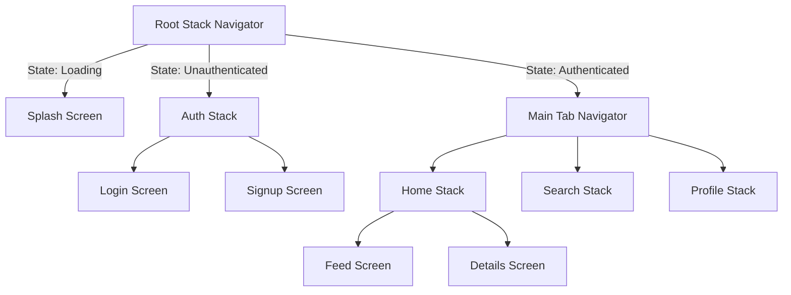

# Phase 3: Navigation & App Architecture

> [!IMPORTANT]
> **Core Objective:** Mastering routing patterns, state architecture, and scalable application structures in React Native.

---

## 📋 Phase Overview
Building on React fundamentals, this phase covers navigation patterns, app architecture, and state management at scale. You'll learn how to structure large React Native applications, implement complex navigation flows, and build maintainable architecture that grows with your app.

---

---

### Q1: [ARCHITECTURE] Scalable Navigation Patterns

**Question:** Design a navigation structure for a large-scale app that includes Auth, Tabs, and Nested Stacks.



> [!TIP]
> **Root Navigator Strategy:**
> A senior approach uses a single Root Stack that conditionally renders either an `AuthStack` or a `MainNavigator` based on the global authentication state.

```tsx
// navigation/RootNavigator.tsx
const RootNavigator = () => {
  const { user, isLoading } = useAuth();
  if (isLoading) return <SplashScreen />;
  return (
    <Stack.Navigator screenOptions={{ headerShown: false }}>
      {user ? (
        <Stack.Screen name="Main" component={MainTabNavigator} />
      ) : (
        <Stack.Screen name="Auth" component={AuthStackNavigator} />
      )}
    </Stack.Navigator>
  );
};
```

---

### Q2: [DEEP LINKING] Deep Linking & Universal Links

**Question:** Explain the difference between Custom URL Schemes and Universal/App Links, and how to handle them.

- **Custom Schemes (`myapp://`):** Easy to set up but less secure (can be hijacked).
- **Universal Links (iOS) / App Links (Android):** Uses standard HTTPS URLs, verified via site association files for high security.

> [!WARNING]
> **Follow-up Trap: Background Links**
> How do you handle a link if the app is already in the background? React Navigation's `linking` config handles this via `subscribe`. Cold starts use `getInitialURL`, while active apps use `Linking.addEventListener`.

---

### Q3: [AUTH] Authentication Flow Implementation

**Question:** What is the best practice for handling login/logout transitions in React Navigation?

Never use `navigation.navigate('Home')` for login. Instead, update the global Auth state and let the `RootNavigator` swap stacks. This automatically cleans up the Auth screens from memory and prevents "back to login" bugs.

---

### Q4: [STATE] Navigation State Persistence

**Question:** Why persist navigation state, and what are the risks in production?

Persistence helps development (reloading on the same screen) but carries risks like stale data or crashes after navigation structure updates. Always use a versioning check for persisted state.

---

### Q5: [PERFORMANCE] Navigation Performance Optimization

**Question:** How do you optimize navigation performance in a large app?

> [!NOTE]
> **Key Tips:**
> - **React Native Screens:** Use native fragments/view controllers for inactive screens.
> - **Freeze:** Enable "freeze" to prevent re-renders in background screens.
> - **Lazy Loading:** Load screens only when they are first accessed.

---

### Q6: [NATIVE] Why use react-native-screens?

**Question:** How does react-native-screens change the way screens are managed at the OS level?

It tells the OS to treat React components as native Fragments (Android) or View Controllers (iOS), significantly reducing memory usage and enabling native animations.

---

### Q7: [TYPES] Type Safety in Navigation

**Question:** How do you implement strong typing for navigation params in a TypeScript project?

Define a `RootStackParamList` and use it with `StackNavigationProp` and `RouteProp` to ensure params are type-safe across the app.

---

### Q8: [EVENTS] Navigation Listeners & Events

**Question:** When would you use the 'focus' or 'blur' events in a navigation screen?

Use 'focus' to refresh data when a user returns to a screen, and 'blur' to stop expensive background tasks (like video playback or location tracking).

---

### Q9: [BUGS] Common Navigation Pitfalls

**Question:** How do you prevent 'double-tap' navigation where the same screen opens twice?

Implement a debounce mechanism or check if the target screen is already at the top of the stack before navigating.

---

### Q10: [ACTIONS] Navigation Actions & Dispatches

**Question:** What is the difference between navigate() and push() in a Stack Navigator?

`navigate()` will go back to an existing screen if it's already in the stack, while `push()` always adds a new instance of the screen to the top.

---

### Q11: [UI] Customizing Transitions

**Question:** How do you implement a custom 'modal' slide-up transition for specific screens?

Use the `presentation: 'modal'` option or define a custom `cardStyleInterpolator` in the screen options.

---

### Q12: [OS] Hardware Back Button (Android)

**Question:** How do you intercept the hardware back button to show an 'Exit App' alert?

Use the `BackHandler` API combined with the `beforeRemove` navigation listener to prevent accidental exits.

---

### Q13: [NOTIFICATIONS] Linking with Push Notifications

**Question:** How do you route a user to a specific screen when they tap a push notification?

Handle the notification in `Linking.getInitialURL` (cold start) or via the notification library's listener (active app), then use the `linking` config to map the notification payload to a screen.

---

### Q14: [HISTORY] Breadcrumbs & Navigation History

**Question:** How do you programmatically reset the navigation history after a specific user action?

Use `navigation.reset()` to replace the current state with a completely new set of screens, useful for flows like "Order Completion."

---

### Q15: [TESTING] Testing Navigation Logic

**Question:** How do you unit test a component that uses the useNavigation hook?

Mock the `useNavigation` hook using `jest.mock` and verify that the correct navigation methods are called with expected parameters.

---

### Q16: [BASIC] Basic navigation setup in React Navigation

**Question:** How do you set up basic navigation in a React Native app?

React Navigation is the most popular navigation library. It provides native navigation components:

```javascript
// Installation
// npm install @react-navigation/native @react-navigation/stack
// npm install react-native-screens react-native-safe-area-context

import { NavigationContainer } from '@react-navigation/native';
import { createStackNavigator } from '@react-navigation/stack';

const Stack = createStackNavigator();

function App() {
  return (
    <NavigationContainer>
      <Stack.Navigator initialRouteName="Home">
        <Stack.Screen
          name="Home"
          component={HomeScreen}
          options={{ title: 'Welcome' }}
        />
        <Stack.Screen
          name="Profile"
          component={ProfileScreen}
          options={{ title: 'My Profile' }}
        />
      </Stack.Navigator>
    </NavigationContainer>
  );
}

// In a screen component
function HomeScreen({ navigation }) {
  return (
    <View style={{ flex: 1, justifyContent: 'center', alignItems: 'center' }}>
      <Text style={{ fontSize: 24 }}>Home Screen</Text>
      <TouchableOpacity
        style={{ marginTop: 20, padding: 10, backgroundColor: '#007AFF' }}
        onPress={() => navigation.navigate('Profile')}
      >
        <Text style={{ color: 'white' }}>Go to Profile</Text>
      </TouchableOpacity>
    </View>
  );
}
```

> [!TIP]
> **🟢 Beginner Tip:** Always wrap your app with `NavigationContainer` at the root. Every screen automatically receives a `navigation` prop for moving between screens.

---

### Q17: [TYPES] Different navigation types and when to use them

**Question:** What are the different types of navigators in React Navigation and when should you use each?

React Navigation provides different navigators for different use cases:

- **📚 Stack Navigator:** Screens stack on top of each other. Like browser history. Best for: Detail screens, forms. Has back button by default.
- **📱 Tab Navigator:** Bottom tabs for main sections. Persistent across navigation. Best for: App main sections. Icons and labels.
- **🗂️ Drawer Navigator:** Side menu slides in. Good for settings, account screens. Best for: Secondary navigation. Customizable content.
- **🔄 Modal:** Overlays current screen. For temporary content. Best for: Confirmations, settings. Can be dismissed.

**Combining Navigators:**

```javascript
// Tab Navigator inside Stack
const Tab = createBottomTabNavigator();
const Stack = createStackNavigator();

function MainTabNavigator() {
  return (
    <Tab.Navigator>
      <Tab.Screen name="Home" component={HomeStack} />
      <Tab.Screen name="Settings" component={SettingsStack} />
    </Tab.Navigator>
  );
}

function HomeStack() {
  return (
    <Stack.Navigator>
      <Stack.Screen name="Home" component={HomeScreen} />
      <Stack.Screen name="Details" component={DetailsScreen} />
    </Stack.Navigator>
  );
}

function RootStack() {
  return (
    <Stack.Navigator>
      <Stack.Screen
        name="Main"
        component={MainTabNavigator}
        options={{ headerShown: false }}
      />
      <Stack.Screen name="Modal" component={ModalScreen} />
    </Stack.Navigator>
  );
}
```

---

### Q18: [DATA] Passing data between screens

**Question:** How do you pass data between screens in React Navigation?

There are several ways to pass data between screens:

**Method 1: Route params (recommended)**

```javascript
function HomeScreen({ navigation }) {
  const user = { id: 1, name: 'John' };

  return (
    <TouchableOpacity
      onPress={() => navigation.navigate('Profile', { user })}
    >
      <Text>Go to Profile</Text>
    </TouchableOpacity>
  );
}

function ProfileScreen({ route, navigation }) {
  const { user } = route.params;

  return (
    <View>
      <Text>Profile: {user.name}</Text>
    </View>
  );
}
```

**Method 2: Navigation options (for headers)**

```javascript
function DetailsScreen({ route, navigation }) {
  const { itemId } = route.params;

  useEffect(() => {
    navigation.setOptions({
      title: `Item ${itemId}`,
    });
  }, [navigation, itemId]);

  return <Text>Details for item {itemId}</Text>;
}
```

**Method 3: Global state (Context, Redux, Zustand)**

```javascript
const UserContext = React.createContext();

function App() {
  const [currentUser, setCurrentUser] = useState(null);

  return (
    <UserContext.Provider value={{ currentUser, setCurrentUser }}>
      <NavigationContainer>
        <Stack.Navigator>
          <Stack.Screen name="Home" component={HomeScreen} />
          <Stack.Screen name="Profile" component={ProfileScreen} />
        </Stack.Navigator>
      </NavigationContainer>
    </UserContext.Provider>
  );
}
```

> [!IMPORTANT]
> **🪤 Follow-up Trap:** *"What's the difference between navigation params and global state?"*
> **Answer:** Use params for screen-specific data that doesn't change the app's global state. Use global state for data that affects multiple screens or persists across navigation.


### Q19: [AUTH] Implementing authentication flow with navigation

**Question:** How do you implement a robust authentication flow using React Navigation?

Authentication flows require conditional navigation based on auth state:

```javascript
// Auth context
const AuthContext = React.createContext();

function AuthProvider({ children }) {
  const [user, setUser] = useState(null);
  const [loading, setLoading] = useState(true);

  useEffect(() => {
    // Check if user is logged in (async storage, etc.)
    checkAuthStatus().then(user => {
      setUser(user);
      setLoading(false);
    });
  }, []);

  const login = async (email, password) => {
    const user = await loginAPI(email, password);
    setUser(user);
    await AsyncStorage.setItem('user', JSON.stringify(user));
  };

  const logout = async () => {
    await logoutAPI();
    setUser(null);
    await AsyncStorage.removeItem('user');
  };

  return (
    <AuthContext.Provider value={{ user, login, logout, loading }}>
      {children}
    </AuthContext.Provider>
  );
}

// Root navigator with conditional rendering
function RootNavigator() {
  const { user, loading } = useContext(AuthContext);

  if (loading) {
    return <SplashScreen />;
  }

  return (
    <NavigationContainer>
      <Stack.Navigator screenOptions={{ headerShown: false }}>
        {user ? (
          <Stack.Screen name="Main" component={MainTabNavigator} />
        ) : (
          <Stack.Screen name="Auth" component={AuthStackNavigator} />
        )}
      </Stack.Navigator>
    </NavigationContainer>
  );
}

// Auth stack
function AuthStackNavigator() {
  return (
    <Stack.Navigator>
      <Stack.Screen name="Login" component={LoginScreen} />
      <Stack.Screen name="Register" component={RegisterScreen} />
      <Stack.Screen name="ForgotPassword" component={ForgotPasswordScreen} />
    </Stack.Navigator>
  );
}

// Main tab navigator
function MainTabNavigator() {
  return (
    <Tab.Navigator>
      <Tab.Screen name="Home" component={HomeScreen} />
      <Tab.Screen name="Profile" component={ProfileScreen} />
    </Tab.Navigator>
  );
}
```

> [!TIP]
> **🟢 Beginner Tip:** Always show a loading screen while checking auth status to avoid flash of incorrect content. Store auth tokens securely using AsyncStorage or secure storage libraries.

---

### Q20: [DEEP LINKING] Implementing deep linking in React Native

**Question:** How do you set up and handle deep linking in a React Native app?

Deep linking allows external URLs to open specific screens in your app:

```javascript
// 1. Configure linking in NavigationContainer
const config = {
  screens: {
    Home: 'home',
    Profile: {
      path: 'user/:userId',
      parse: {
        userId: (userId) => parseInt(userId, 10),
      },
    },
    Settings: 'settings',
  },
};

function App() {
  const linking = {
    prefixes: ['myapp://', 'https://myapp.com'],
    config,
  };

  return (
    <NavigationContainer linking={linking} fallback={<Text>Loading...</Text>}>
      <Stack.Navigator>
        <Stack.Screen name="Home" component={HomeScreen} />
        <Stack.Screen name="Profile" component={ProfileScreen} />
        <Stack.Screen name="Settings" component={SettingsScreen} />
      </Stack.Navigator>
    </NavigationContainer>
  );
}

// 2. Handle deep links programmatically
import { Linking } from 'react-native';

function useDeepLinkHandler() {
  useEffect(() => {
    const handleDeepLink = (event) => {
      const { url } = event;
      // Parse URL and navigate
      if (url.includes('user/')) {
        const userId = url.split('user/')[1];
        navigation.navigate('Profile', { userId: parseInt(userId) });
      }
    };

    // Handle initial URL (app opened from link)
    Linking.getInitialURL().then((url) => {
      if (url) handleDeepLink({ url });
    });

    // Handle URL when app is already open
    const subscription = Linking.addEventListener('url', handleDeepLink);

    return () => subscription?.remove();
  }, []);
}

// 3. Create links in your app
function ShareButton({ itemId }) {
  const shareLink = () => {
    const url = `myapp://item/${itemId}`;
    // Use Share API or copy to clipboard
    Share.share({ message: `Check out this item: ${url}` });
  };

  return (
    <TouchableOpacity onPress={shareLink}>
      <Text>Share</Text>
    </TouchableOpacity>
  );
}
```

---

### Q21: [STATE] Managing navigation state and persistence

**Question:** How can you persist navigation state across app restarts?

React Navigation can persist and restore navigation state:

```javascript
// Persist navigation state to AsyncStorage
import AsyncStorage from '@react-native-async-storage/async-storage';

const PERSISTENCE_KEY = 'NAVIGATION_STATE';

function App() {
  const [isReady, setIsReady] = useState(false);
  const [initialState, setInitialState] = useState();

  useEffect(() => {
    const restoreState = async () => {
      try {
        const savedStateString = await AsyncStorage.getItem(PERSISTENCE_KEY);
        const state = savedStateString ? JSON.parse(savedStateString) : undefined;

        if (state !== undefined) {
          setInitialState(state);
        }
      } finally {
        setIsReady(true);
      }
    };

    restoreState();
  }, []);

  if (!isReady) {
    return <SplashScreen />;
  }

  return (
    <NavigationContainer
      initialState={initialState}
      onStateChange={(state) =>
        AsyncStorage.setItem(PERSISTENCE_KEY, JSON.stringify(state))
      }
    >
      <Stack.Navigator>
        <Stack.Screen name="Home" component={HomeScreen} />
        <Stack.Screen name="Profile" component={ProfileScreen} />
      </Stack.Navigator>
    </NavigationContainer>
  );
}

// Reset navigation state (useful after login/logout)
function resetNavigationToHome(navigation) {
  navigation.reset({
    index: 0,
    routes: [{ name: 'Home' }],
  });
}
```

> [!TIP]
> **🟢 Beginner Tip:** Navigation state persistence survives app restarts but can become stale. Always validate that screens still exist when restoring state.


### Q22: [ANIMATION] Custom navigation transitions and animations

**Question:** How do you implement custom screen transitions and header animations in React Navigation?

React Navigation allows extensive customization of screen transitions:

```javascript
// Custom transition spec
const config = {
  animation: 'spring',
  config: {
    stiffness: 1000,
    damping: 500,
    mass: 3,
    overshootClamping: true,
    restDisplacementThreshold: 0.01,
    restSpeedThreshold: 0.01,
  },
};

// Apply to specific screens
function StackNavigator() {
  return (
    <Stack.Navigator
      screenOptions={{
        transitionSpec: {
          open: config,
          close: config,
        },
        cardStyleInterpolator: CardStyleInterpolators.forHorizontalIOS,
      }}
    >
      <Stack.Screen
        name="Home"
        component={HomeScreen}
        options={{
          transitionSpec: {
            open: TransitionSpecs.ScaleFromCenterAndroid,
            close: TransitionSpecs.ScaleFromCenterAndroid,
          },
        }}
      />
      <Stack.Screen name="Modal" component={ModalScreen} />
    </Stack.Navigator>
  );
}

// Custom header with animations
function CustomHeader() {
  const progress = useHeaderHeight();

  return (
    <Animated.View
      style={{
        height: progress.interpolate({
          inputRange: [0, 1],
          outputRange: [100, 50],
        }),
        backgroundColor: progress.interpolate({
          inputRange: [0, 1],
          outputRange: ['#ff0000', '#0000ff'],
        }),
      }}
    >
      <Text>Custom Header</Text>
    </Animated.View>
  );
}
```

---

### Q23: [ARCHITECTURE] Scalable app architecture patterns

**Question:** How do you structure a large-scale React Native project for maintainability?

Large React Native apps need careful architecture planning, often using a feature-based organization:

```text
// 📁 src/
├── features/           # Feature-based organization
│   ├── auth/
│   │   ├── components/
│   │   ├── screens/
│   │   ├── hooks/
│   │   ├── services/
│   │   └── types.ts
│   ├── products/
│   │   ├── components/
│   │   ├── screens/
│   │   ├── hooks/
│   │   ├── services/
│   │   └── types.ts
│   └── settings/
├── shared/            # Shared utilities
│   ├── components/
│   ├── hooks/
│   ├── utils/
│   └── constants/
├── navigation/
│   ├── navigators/
│   └── types.ts
└── store/            # Global state
    ├── slices/
    └── store.ts

// Feature folder structure
// 📁 features/auth/
├── index.ts          # Public API exports
├── components/
│   ├── LoginForm.tsx
│   └── RegisterForm.tsx
├── screens/
│   ├── LoginScreen.tsx
│   └── RegisterScreen.tsx
├── hooks/
│   ├── useAuth.ts
│   └── useLogin.ts
├── services/
│   ├── authAPI.ts
│   └── tokenStorage.ts
└── types.ts

// Barrel exports for clean imports
// features/auth/index.ts
export { LoginScreen } from './screens/LoginScreen';
export { RegisterScreen } from './screens/RegisterScreen';
export { useAuth } from './hooks/useAuth';
export { login, logout } from './services/authAPI';

// Usage
import { LoginScreen, useAuth } from '@/features/auth';
```

---

### Q24: [STATE] Choosing the right state management solution

**Question:** Compare different state management solutions for React Native.

| Solution | Best For | Complexity | Bundle Size |
| :--- | :--- | :--- | :--- |
| **useState/useReducer** | Component state, simple global state | Low | None |
| **Context API** | Medium apps, theme/user settings | Medium | Small |
| **Zustand** | Most apps, great DX, scalable | Low | Small |
| **Redux Toolkit** | Large teams, complex async logic | Medium-High | Medium |
| **Recoil/MobX** | Complex state relationships | High | Large |

---

### Q25: [PERFORMANCE] Navigation performance optimization techniques

**Question:** What are the key strategies to optimize navigation performance?

Optimize navigation for better user experience:

```javascript
// 1. Lazy loading screens
const LazyProfileScreen = lazy(() => import('./ProfileScreen'));

function ProfileStack() {
  return (
    <Stack.Navigator>
      <Stack.Screen name="Profile" component={LazyProfileScreen} />
    </Stack.Navigator>
  );
}

// 2. Preloading important screens
function App() {
  useEffect(() => {
    // Preload heavy screens in background
    const preloadScreens = async () => {
      await Promise.all([
        import('./screens/HeavyScreen1'),
        import('./screens/HeavyScreen2'),
      ]);
    };

    preloadScreens();
  }, []);

  return <NavigationContainer>...</NavigationContainer>;
}

// 3. Optimize screen options
function OptimizedScreen() {
  return (
    <Stack.Screen
      name="Home"
      component={HomeScreen}
      options={{
        headerShown: false, // Remove header if not needed
        gestureEnabled: false, // Disable swipe gestures if not needed
        animationEnabled: false, // Disable animations for fast screens
      }}
    />
  );
}

// 4. Use react-native-screens for better performance
// This is enabled by default in React Navigation v6+

// 5. Memoize navigation options
const screenOptions = useMemo(() => ({
  headerStyle: { backgroundColor: theme.colors.primary },
  headerTintColor: theme.colors.text,
}), [theme]);

function StackNavigator() {
  return (
    <Stack.Navigator screenOptions={screenOptions}>
      <Stack.Screen name="Home" component={HomeScreen} />
    </Stack.Navigator>
  );
}
```

---

[⬅️ Phase 02: React Fundamentals](./phase2-react-fundamentals.md) | [Next Phase ➡️](./phase4-performance-memory.md)

