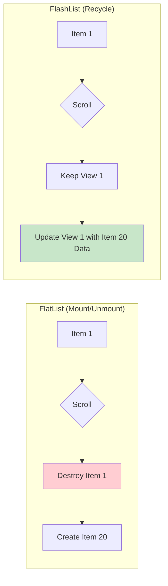

# Phase 04: Performance & Memory Management

Profiling, Optimization, Memory Leaks, and Threading

---

### 📋 Phase Overview
Master React Native performance optimization from basic list rendering to advanced memory management and threading. Learn to profile, debug, and optimize your apps for smooth 60fps experiences across all devices.

---

### Q1: [LIST RENDERING] FlatList vs FlashList: The Recycling Revolution
**Question:** Why is Shopify's FlashList preferred over FlatList for high-performance apps, and how does it work internally?



#### 🔄 Cell Recycling vs. Destruction
- **FlatList**: Destroys off-screen components and re-creates them as the user scrolls. This causes "blanking" during fast scrolls because JS can't keep up with component creation.
- **FlashList**: Reuses (recycles) the underlying native views. It only updates the data (props) of an existing view, which is significantly faster than creating a new one.

> [!TIP]
> **Senior Insight: Estimated Item Size**
> The most critical prop in FlashList is `estimatedItemSize`. If this is inaccurate, the list will "jump" or flicker as it re-calculates layout on the fly.

---

### Q2: [LISTS] FlatList Optimization Props
**Question:** How do you optimize a FlatList for large datasets, and when should you use ScrollView instead?

#### 📜 Selection & Optimization
- **ScrollView**: Use for small, fixed-size content where all items can be rendered at once.
- **FlatList**: Use for large or infinite datasets. It renders items lazily (only what's on screen).
- **Optimization Props**:
  - `initialNumToRender`: Render only enough to fill the first screen.
  - `maxToRenderPerBatch`: Limit how many items are added per "tick."
  - `windowSize`: Keep fewer off-screen items in memory (default is 21, try 5).
  - `getItemLayout`: Skip dynamic measurement if item heights are fixed.
  - `removeClippedSubviews`: Unmount off-screen views for memory savings.

```javascript
<FlatList
  data={data}
  renderItem={renderItem}
  keyExtractor={(item) => item.id}
  initialNumToRender={10}
  maxToRenderPerBatch={10}
  windowSize={5}
  removeClippedSubviews={true}
  getItemLayout={(data, index) => ({
    length: ITEM_HEIGHT,
    offset: ITEM_HEIGHT * index,
    index,
  })}
/>
```

> [!TIP]
> **Senior Insight: keyExtractor**
> Always use a unique ID for `keyExtractor`. Using the index as a key is a "performance anti-pattern" that causes unnecessary re-renders during list updates.

---

### Q3: [GRAPHICS] SVG vs. PNG in Large Lists
**Question:** Why might SVGs cause performance issues in a FlatList with 100 items?

#### 🎨 CPU vs. GPU
- **PNGs**: Decoded once and handled by the GPU. Very efficient for lists.
- **SVGs**: The `react-native-svg` library has to parse XML paths and draw them on the CPU for every item. In a fast-scrolling list, this can max out the CPU and cause jank.

> [!WARNING]
> **Follow-up Trap: "How to optimize SVGs?"**
> **Answer:** Use **Icon Fonts** for simple icons or convert SVGs to PNG sprites for complex ones used in large lists.

---

### Q4: [ANIMATIONS] Off-Main-Thread Animations
**Question:** Explain the difference between the 'Native Driver' in Animated API and Reanimated 3.

#### ⚡ Animation Engines
1. **Animated (Native Driver)**: Can only animate non-layout properties (Opacity, Transform). It serializes the animation once and runs it on the Native UI thread.
2. **Reanimated 3 (Worklets)**: Uses JSI to run JS code (Worklets) on a dedicated **Secondary JS Thread**. This allows animating *layout* properties (Width, Height, Flex) without blocking the main JS thread.

---

### Q5: [ANIMATIONS] LayoutAnimations vs. Reanimated
**Question:** When would you use the built-in LayoutAnimation over Reanimated?

#### 🏗️ Layout Transitions
`LayoutAnimation` is great for simple "automatic" transitions (e.g., items moving when one is deleted). It runs entirely on the native side. However, it's difficult to customize compared to Reanimated's Shared Values.

> [!WARNING]
> **Follow-up Trap: "Is LayoutAnimation thread-safe?"**
> **Answer:** It runs on the UI thread, making it very smooth, but it can sometimes conflict with other animations.

---

### Q6: [THREADS] JS Thread vs. UI Thread
**Question:** What happens when the JS thread is blocked, and how does it differ from the UI thread being blocked?

#### 🧵 Thread Comparison
- **JS Thread Blocked**: UI still responds to touches (e.g., button highlight), but nothing *happens* (no navigation, no data update).
- **UI Thread Blocked**: The entire app freezes. No animations, no scrolls, no touch highlights.

---

### Q7: [THREADS] The Threading Architecture
**Question:** Explain the four primary threads in a React Native app.

#### 🏗️ Threading Model
1. **Main Thread (UI)**: Handles native rendering and user interactions.
2. **JS Thread**: Where business logic and React reconciliation run.
3. **Shadow Thread**: Where Yoga calculates layout before passing it to UI.
4. **Native Modules Thread**: Handles background tasks (I/O, GPS).

> [!WARNING]
> **Follow-up Trap: "What happens if the JS thread is busy?"**
> **Answer:** Animations might still run (if using Native Driver), but the app won't respond to business logic (e.g., button clicks won't trigger navigation).

---

### Q8: [ARCHITECTURE] Yoga Engine & Over-Nesting
**Question:** How does the Yoga engine calculate layout, and why does 'over-nesting' hurt performance?

#### 📐 Layout Calculation
Yoga is a C++ library implementing Flexbox. It performs recursive tree traversal. Deeply nested views (15+ levels) cause exponential increases in layout calculation time. Use the Inspector to flatten your tree.

---

### Q9: [ARCHITECTURE] Bridge Traffic & JSI
**Question:** What is the 'Bridge', and how does JSI solve its performance bottlenecks?

#### 🌉 The Serialization Problem
- **Bridge**: Every call is serialized into JSON. Large payloads or high-frequency calls (60fps) saturate the bridge, causing lag.
- **JSI (JavaScript Interface)**: Allows direct C++ function calls from JS. No JSON serialization, no async overhead.

> [!TIP]
> **Senior Insight: Synchronous Access**
> With JSI, you can get values from native synchronously. This is critical for animations or real-time data where an asynchronous delay would cause visible "lag."

---

### Q10: [ARCHITECTURE] The New Architecture (Fabric & TurboModules)
**Question:** What are the performance benefits of Fabric and TurboModules?

#### 🚀 Next-Gen Rendering
- **Fabric**: The new renderer that uses JSI to communicate directly with C++ shadows, enabling synchronous updates and priority rendering.
- **TurboModules**: Loads native modules lazily (saving startup time) and provides direct synchronous access via JSI.

---

### Q11: [PROFILING] Advanced Profiling: Flipper & Flashlight
**Question:** How do you use Flipper and Flashlight to measure performance?

#### 📊 Automated Profiling
- **Flipper**: Used for manual inspection of network, logs, and layout.
- **Flashlight**: A CLI tool to measure TTI, FPS, and CPU usage on real devices.

> [!TIP]
> **Senior Insight: Real Device Testing**
> Never trust Simulator/Emulator performance. Always profile on a low-end Android device to see the true performance.

---

### Q12: [COMPUTATION] Heavy Computations: Worklets & C++
**Question:** How do you handle heavy data processing without freezing the UI?

#### ⚙️ Offloading Work
1. **Worklets**: Run on the UI thread (good for UI-related calculations).
2. **Native Modules (C++)**: Perform the processing in C++ and return only the result via JSI.
3. **InteractionManager**: Delay tasks until animations have completed.

---

### Q13: [JSON] Large JSON Parsing Performance
**Question:** Why is JSON.parse() dangerous for 5MB+ payloads, and how do you optimize it?

#### 📉 Parsing Overhead
`JSON.parse()` is synchronous and blocking. Parsing a 5MB JSON can freeze the JS thread for 100ms+. 

**Optimization**: 
1. Use pagination/GraphQL to fetch smaller chunks.
2. Use a native module to parse JSON in the background and return a JSI reference.

> [!WARNING]
> **Follow-up Trap: "What about JSON.stringify?"**
> **Answer:** Equally dangerous for large objects, especially when sending data across the bridge.

---

### Q14: [ASSETS] Asset Pre-loading & Caching

**Question:** How do you implement a robust pre-loading strategy for fonts and images?

#### 📥 Pre-loading
Use `Asset.loadAsync` (Expo) or manual pre-fetching. For fonts, ensure they are loaded before the first render to avoid "FOIT" (Flash of Invisible Text). For images, use a priority queue to load "above-the-fold" images first.

> [!TIP]
> **Senior Insight: Priority Loading**
> Don't pre-load everything. Pre-load only the assets needed for the first 3 screens to keep the initial download size and startup time low.

---

### Q15: [NETWORK] Network Caching & Perceived Performance
**Question:** How do RTK Query or TanStack Query improve perceived performance?

#### ⚡ Optimistic UI
These libraries provide "Stale-While-Revalidate" caching. The user sees old data immediately while the app fetches new data in the background. Combined with **Optimistic Updates**, the app feels instantaneous.

> [!WARNING]
> **Follow-up Trap: "What is the risk of optimistic updates?"**
> **Answer:** You must handle rollback logic if the network request fails, or the UI will be out of sync with the server.

---

### Q16: [STABILITY] Global Error Boundaries & Crash Reporting
**Question:** How do you ensure a single JS error doesn't crash the entire app for a user?

#### 🛡️ Error Resilience
Implement a `Global Error Boundary` at the root. Catch errors, log them to **Sentry** with the full breadcrumb trail, and show a "Friendly Fallback UI" that allows the user to restart the app or go back to the home screen.

---

### Q17: [BASICS] Why Performance Matters
**Question:** Why is React Native performance critical for business and user experience?

#### 🎯 Impact Areas
- **User Experience**: Slow apps frustrate users, leading to abandonment and poor retention.
- **App Store Ratings**: Performance issues (jank, crashes) are the #1 cause of 1-star reviews.
- **Business Impact**: Better performance correlates directly with higher conversion rates and revenue.

> [!TIP]
> **Beginner Tip: Performance-First Mindset**
> Performance isn't a "post-launch" task. It's a core requirement. Always profile and optimize before considering features "done".

---

### Q18: [OPTIMIZATION] Preventing Unnecessary Re-renders
**Question:** What are the most effective ways to prevent components from re-rendering needlessly?

#### 🛠️ Optimization Techniques
- **React.memo**: Memoize functional components to prevent re-renders unless props change.
- **useMemo**: Cache expensive calculations between renders.
- **useCallback**: Maintain stable function references to prevent child components from re-rendering.
- **Stable Props**: Avoid passing inline objects `{{ ... }}` or anonymous functions `() => ...` as props.

```javascript
// ✅ Stable object reference
const styles = useMemo(() => ({ margin: 10 }), []);

// ✅ Stable function reference
const handlePress = useCallback(() => {
  console.log("Pressed!");
}, []);

return <ChildComponent style={styles} onPress={handlePress} />;
```

---

### Q19: [IMAGES] Performance-First Images
**Question:** What are the best practices for handling images in a performance-critical app?

#### 🖼️ Optimization Techniques
1. **FastImage**: Use `react-native-fast-image` for superior caching and priority control.
2. **Resize Method**: On Android, use `resizeMethod="resize"` for large images to reduce memory footprint.
3. **WebP**: Use WebP format for smaller file sizes with similar quality to PNG/JPG.
4. **Lazy Loading**: Only load images when they are about to enter the viewport.

---

### Q20: [MEMORY] Identifying and Fixing Leaks
**Question:** What are common causes of memory leaks in React Native, and how do you fix them?

#### 💧 Common Leak Sources
- **Uncleared Timers**: `setTimeout` or `setInterval` not cleared on component unmount.
- **Event Listeners**: Adding listeners (e.g., `BackHandler`, `Keyboard`) without removing them.
- **Closures**: Capturing large objects in `useEffect` or event callbacks.
- **Subscriptions**: Not unsubscribing from RxJS, Apollo, or Redux observers.

#### ✅ The Cleanup Pattern
```javascript
useEffect(() => {
  const timer = setInterval(() => { /* ... */ }, 1000);
  const sub = eventEmitter.addListener('event', handler);

  return () => {
    clearInterval(timer);
    sub.remove();
  };
}, []);
```

---

### Q21: [BUNDLE] Code Splitting & Tree Shaking
**Question:** How do you reduce the JS bundle size to improve app startup time?

#### 📦 Bundle Optimization
- **Inline Requires**: Enable `inlineRequires` in `metro.config.js` to load modules only when needed.
- **Dynamic Imports**: Use `React.lazy` and `Suspense` for heavy components that aren't needed immediately.
- **Avoid Heavy Libs**: Replace `moment` with `date-fns` and `lodash` with `lodash-es`.
- **Asset Auditing**: Use `react-native-bundle-visualizer` to find large dependencies.

---

### Q22: [STARTUP] Optimizing TTI (Time to Interactive)
**Question:** What strategies can be used to minimize the time it takes for an app to become interactive?

#### 🚀 Startup Strategies
1. **Hermes Engine**: Pre-compiles JS into bytecode, skipping the parse/compile phase on device.
2. **Splash Screen**: Keep the splash screen active until the first meaningful paint is ready.
3. **Minimize Initial Render**: Don't render complex UI hidden behind tabs or modals until needed.
4. **Pre-fetching**: Fetch critical data during the splash screen phase.

---


---

### Q23: [REACT 18] Concurrent Features
**Question:** How do React 18's concurrent features improve performance?

#### ⚡ Key Features
- **Automatic Batching**: Multiple state updates in one event loop are combined into a single render.
- **startTransition**: Marks non-urgent updates (like filtering a list) as interruptible.
- **Suspense**: Simplifies loading states and allows for concurrent data fetching patterns.

```javascript
import { startTransition } from 'react';

function Search() {
  const [query, setQuery] = useState('');
  const [results, setResults] = useState([]);

  const handleSearch = (text) => {
    setQuery(text); // Urgent: Update input
    startTransition(() => {
      setResults(performExpensiveSearch(text)); // Non-urgent: Filter list
    });
  };
}
```

---

### Q24: [MEMORY] Advanced Profiling & Object Pooling
**Question:** How do you handle memory-intensive operations like high-frequency animations?

#### 🧠 Memory Management
- **Object Pooling**: Instead of creating/destroying objects 60 times a second, reuse them from a pool to reduce GC pressure.
- **Maps vs. Objects**: Use `Map` for large collections with frequent additions/deletions.
- **Hermes Heap Snapshots**: Use the Flipper Memory plugin to compare snapshots and find leaks.

---

### Q25: [MONITORING] Production Performance Monitoring
**Question:** How do you track performance in the wild?

#### 📈 Monitoring Strategies
- **FPS Monitoring**: Track `jsFps` and `uiFps` via `react-native-performance`.
- **TTI Tracking**: Measure the time from app launch until first interaction.
- **Error Boundaries**: Log rendering crashes to Sentry with attached performance breadcrumbs.

---


---

[⬅️ Phase 03: Navigation](./phase3-navigation-architecture.md) | [Next Phase ➡️](./phase5-native-modules-apis.md)
